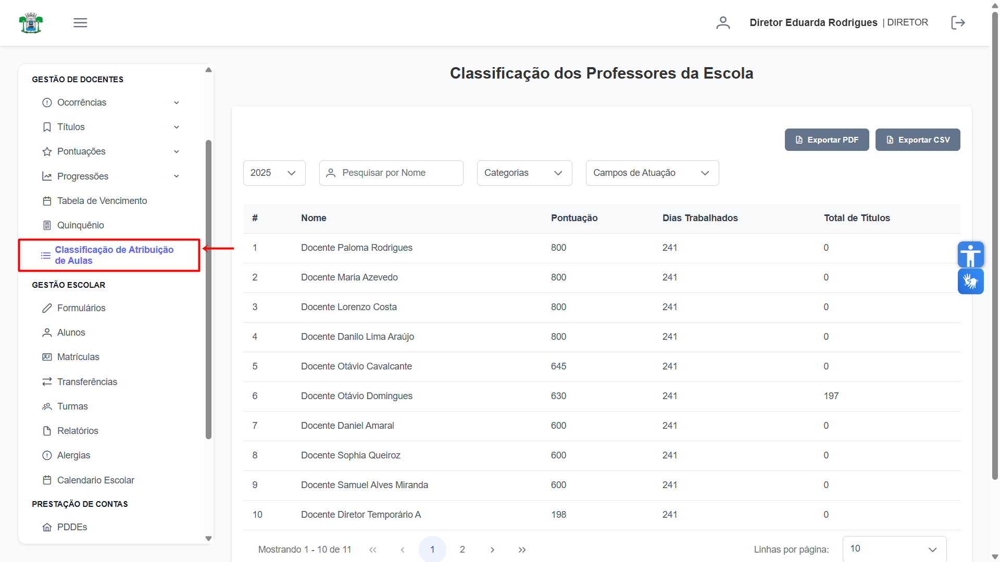
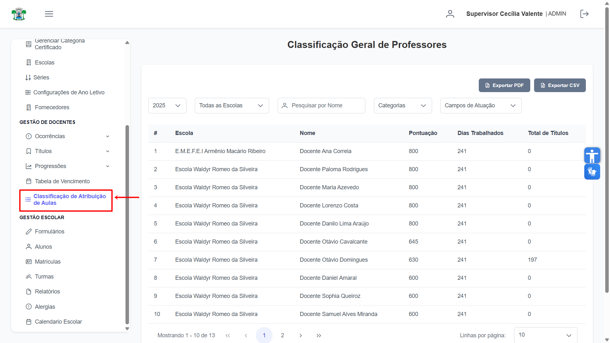
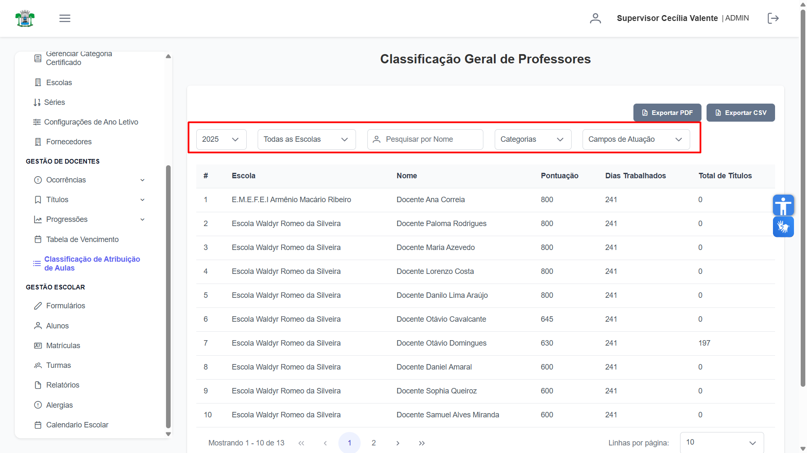
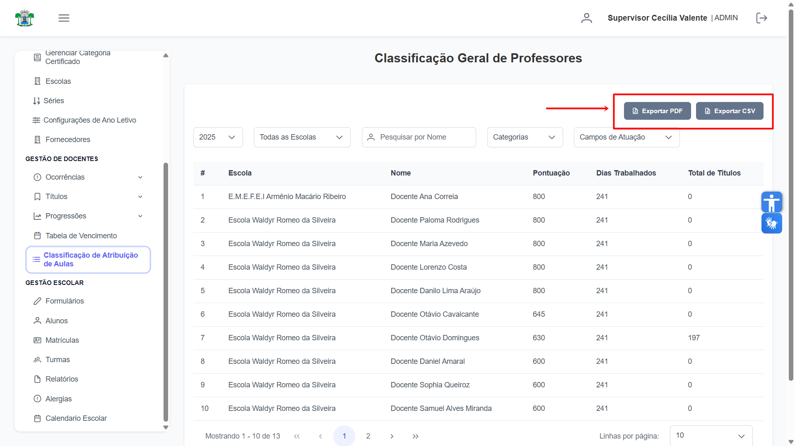

# Classificação de Atribuição de Aulas

Esta seção permite a consulta da classificação dos docentes para a atribuição de aulas. O acesso varia conforme o perfil do usuário: O **Supervisor** consulta a Classificação Geral, enquanto **Diretores** visualizam a classificação específica de sua escola.

## Consultar Classificação

Na aba de "Classificação de Atribuição de Aulas", esta é a **Classificação dos Professores** da escola para o **Diretor**:

Na aba de "Classificação de Atribuição de Aulas", esta é a **Classificação  Geral** dos professores para o **Supervisor**:

Para refinar a consulta, estão disponíveis os seguintes filtros para ambos os perfis: **ano, nome, categoria e campos de atuação**. Adicionalmente, o **Supervisor** pode filtrar os resultados por escola.

A lista exibida pode ser exportada a qualquer momento. No canto superior direito da tela, utilize os botões **"Exportar PDF"** ou **"Exportar CSV"** para baixar o arquivo no formato desejado.
