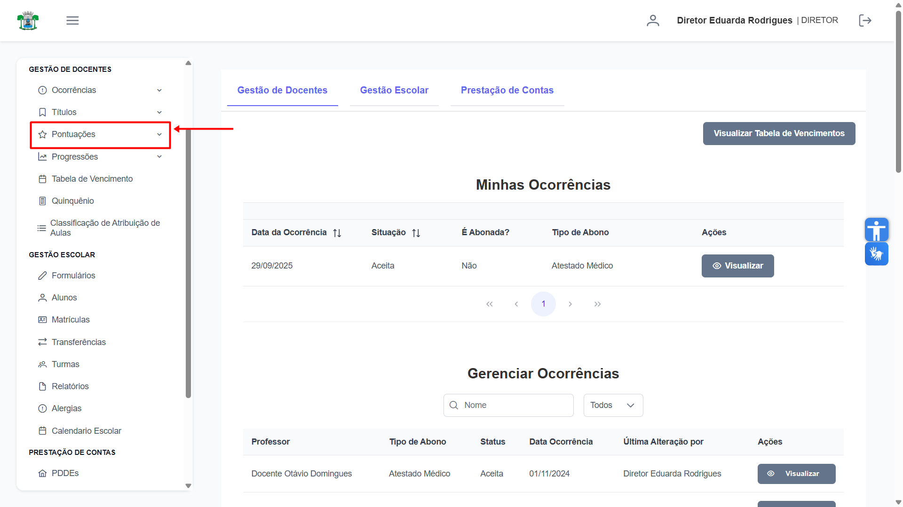
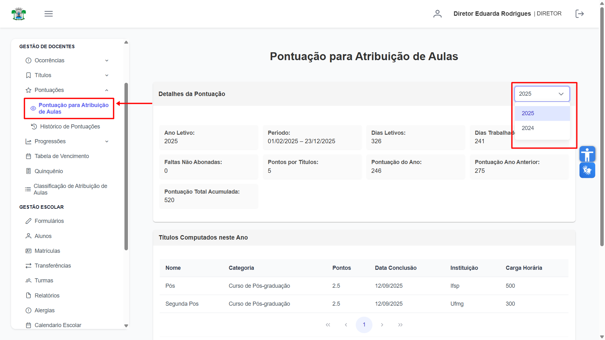
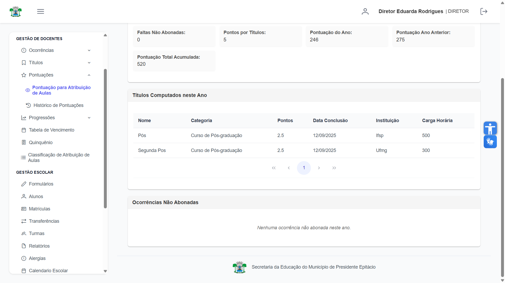
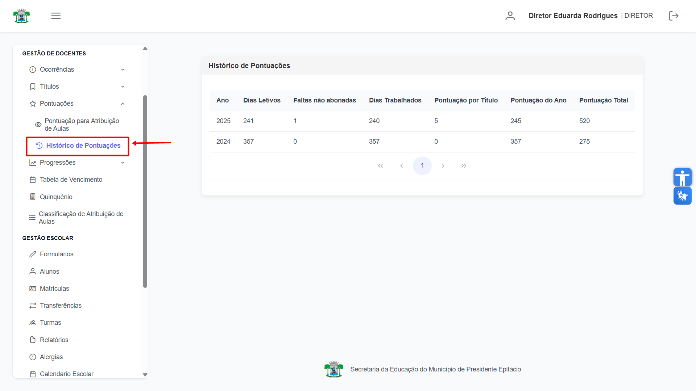

# Pontuações

Nesta seção, tanto **Diretores** quanto Docentes podem acompanhar os detalhes de suas pontuações para a atribuição de aulas.

## Acompanhar Pontuações

A tela de **"Pontuações"** é dividida em duas abas principais, que permitem uma análise completa da pontuação atual e do histórico do usuário.

## Pontuação Para Atribuição de Aulas

Nesta aba, é possível consultar em detalhes a composição da sua pontuação atual. Utilize o filtro de **"Ano"** para visualizar a pontuação de um período específico.

Ao rolar a página, são exibidas seções adicionais com os **Títulos Computados neste Ano** e as **Ocorrências Não Abonadas**, que impactam diretamente o cálculo.

## Histórico de Pontuações

Esta aba apresenta um registro completo das suas pontuações em anos anteriores, permitindo acompanhar sua evolução ao longo do tempo.
