# Títulos

Esta seção é dedicada ao gerenciamento de Títulos. Os **Docentes** utilizam esta área para cadastrar suas formações e qualificações, enquanto os **Diretores** são responsáveis por validar e gerenciar esses registros.

## Controle de Títulos

Na aba de "Títulos":
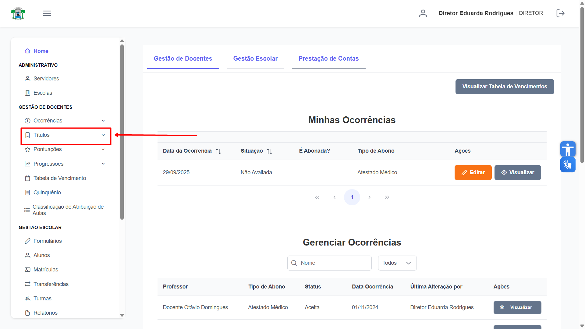

## Lançar Títulos

Na aba **"Lançar Títulos"**, clique no botão verde **"Cadastrar Título"** no canto superior direito para iniciar um novo registro. 
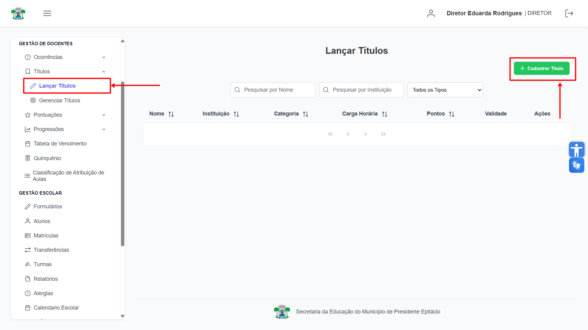

Clicando no botão, irá abrir uma tela para Lançar um novo Título. Agora preencha os campos **"Nome"**, **"Instituição"** e **"Carga Horária"**.
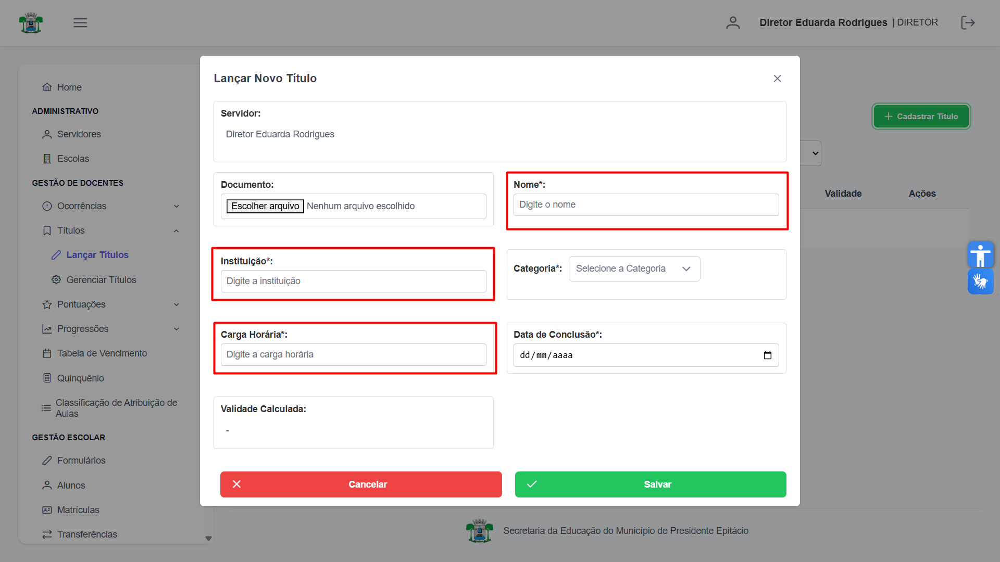

Anexe o **Documento**.
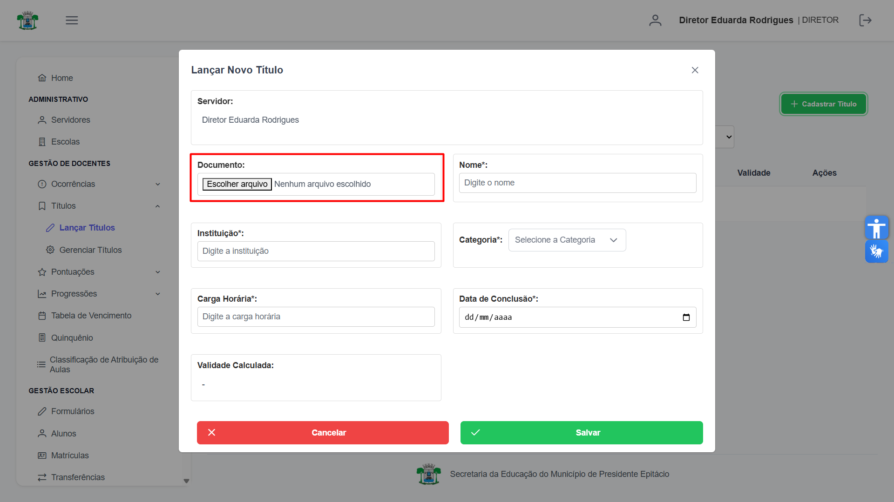

Selecione a **Categoria**.
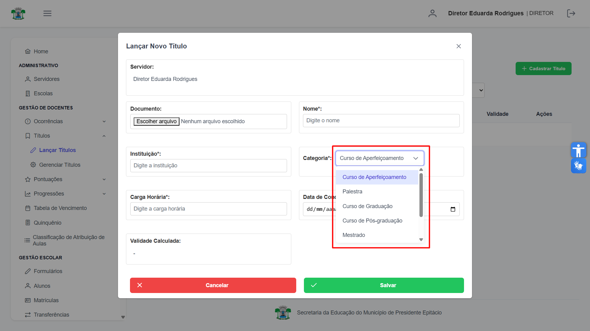

Selecione a **Data de Conclusão**.
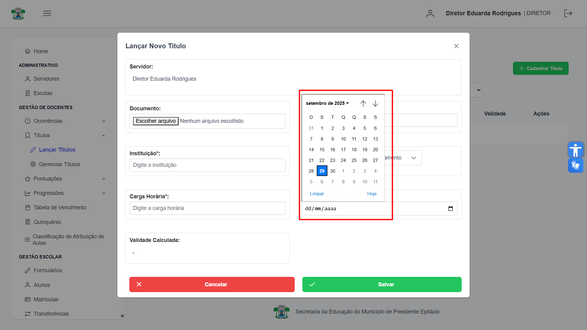

Com a Data selecionada, a **Validade** será calculada automaticamente.
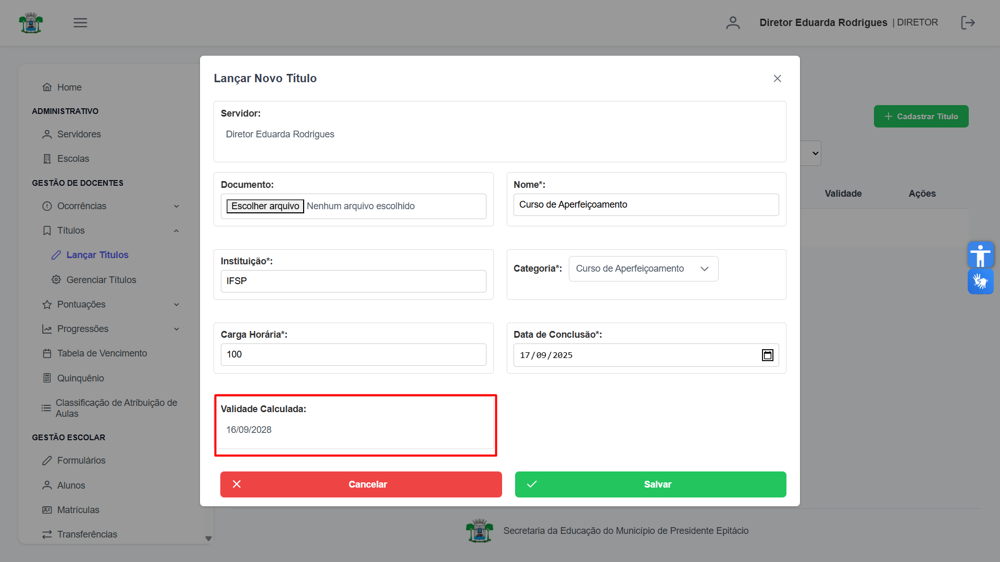

Após preencher todos os campos, clique em **"Salvar"** e confirme a ação.
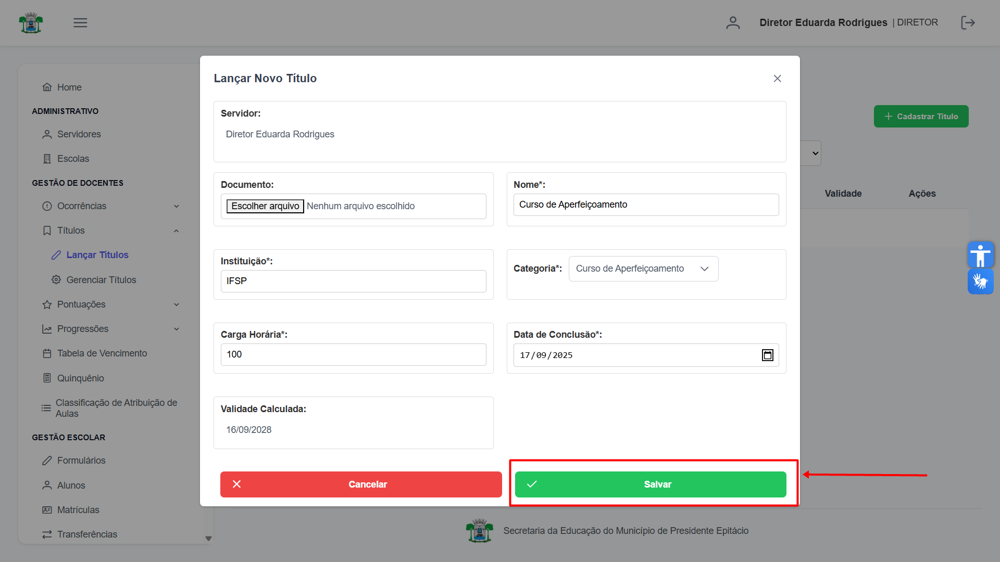

Clicando no botão "Salvar", aparecerá uma tela de confirmação. 
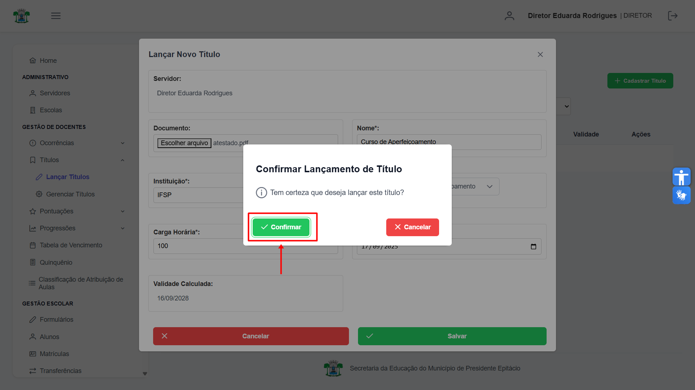

Após a confirmação, o título será adicionado à lista e aguardará a validação do diretor. Você pode clicar em **"Visualizar"** para conferir o documento que foi enviado.
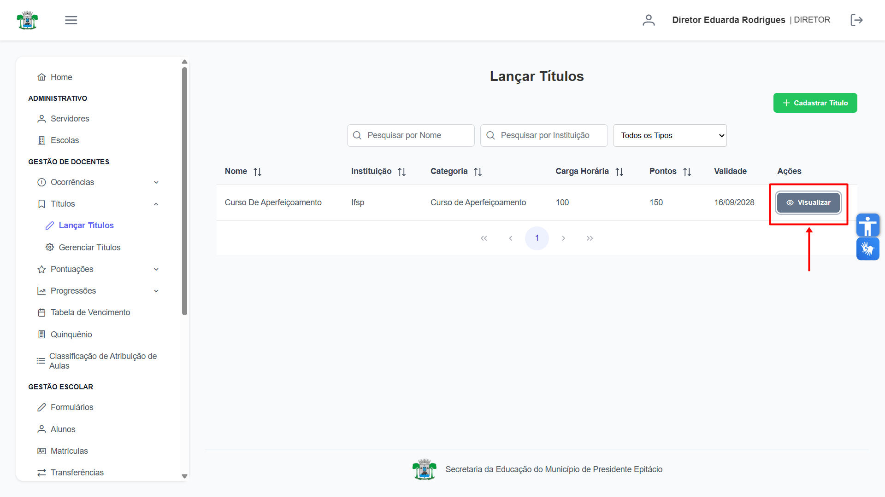

## Gerenciar Títulos

Na aba **"Gerenciar Títulos"**, o diretor visualiza todos os títulos cadastrados pelos docentes de sua escola. Para avaliar um título, clique no botão **"Visualizar"**.
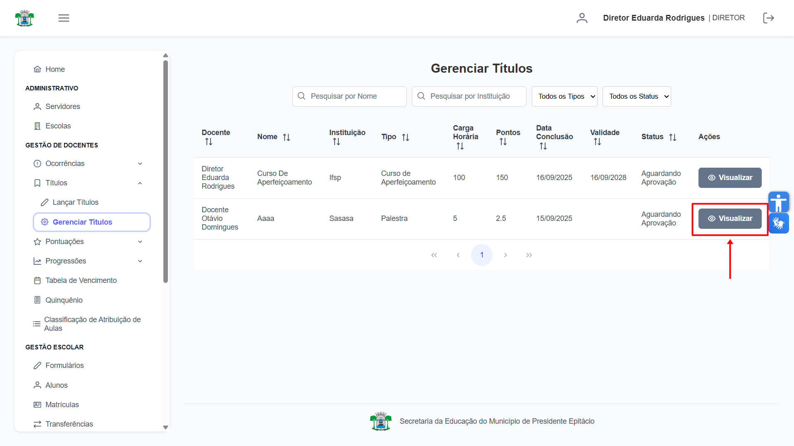

Após clicar no botão, irá abrir uma tela com os detalhes do Título correspondente, onde é possível **visualizar** o atestado, **aceitar**, **recusar** ou **excluir** o Título.
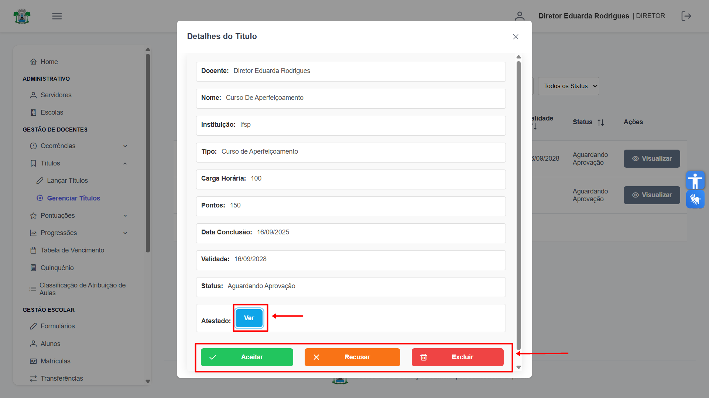

Ao clicar em **"Recusar"**, o status do título será alterado para **"Não Aceito"**. 
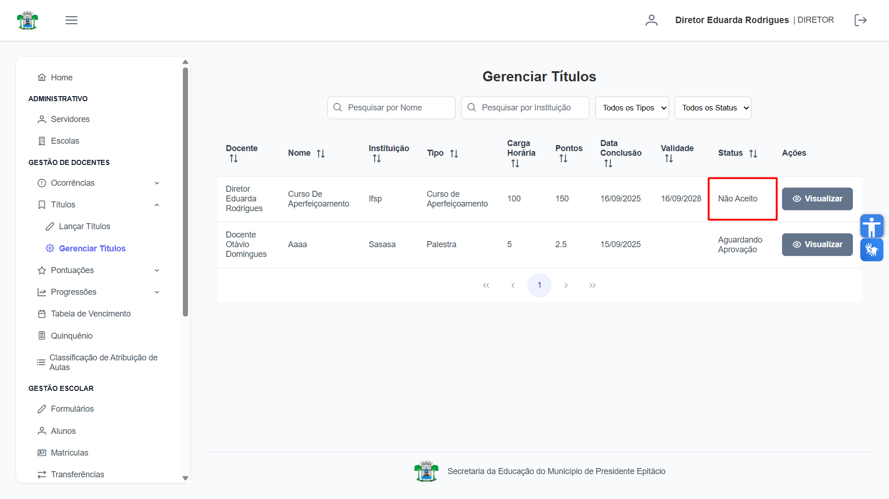

A opção **"Excluir"** remove permanentemente o registro do título do sistema.
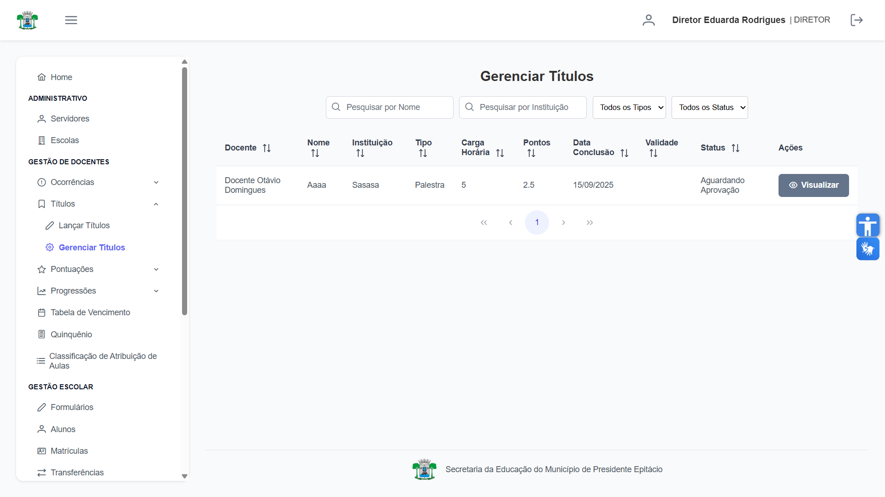

Ao clicar em **"Aceitar"**, o título é validado e seu status muda para **"Aceito"**.
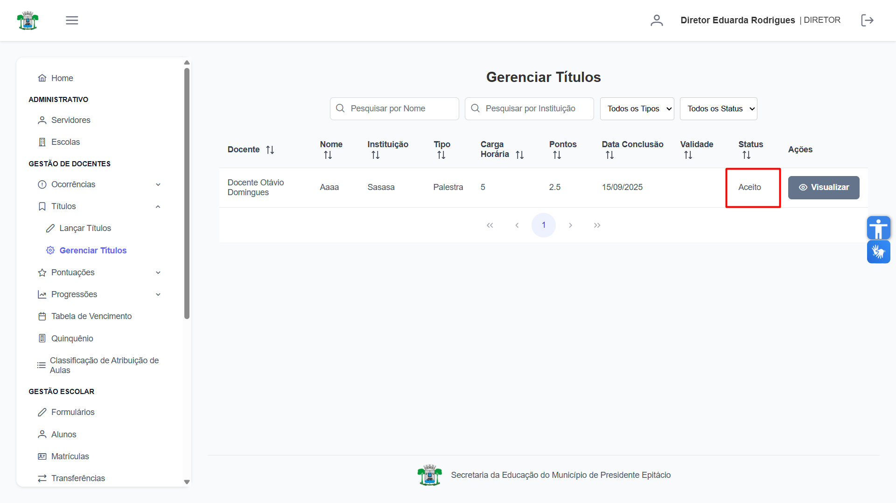