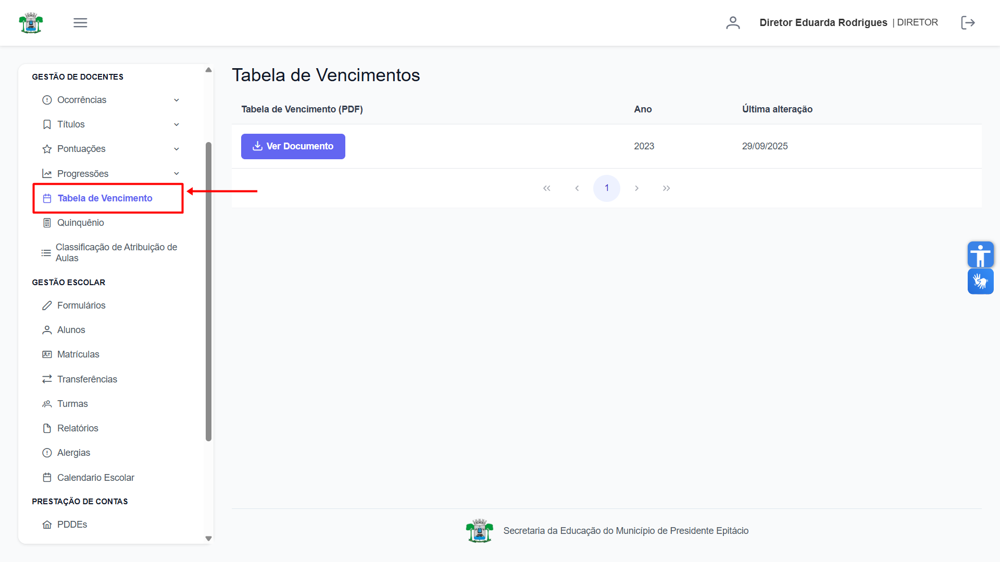
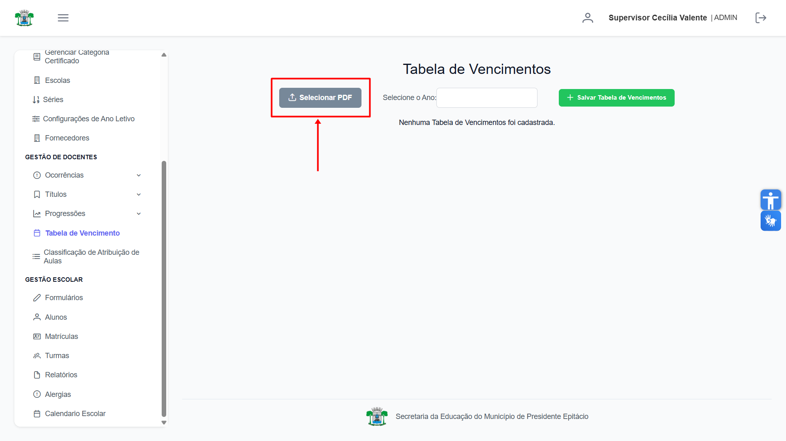
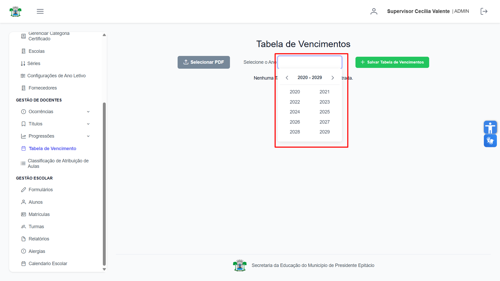
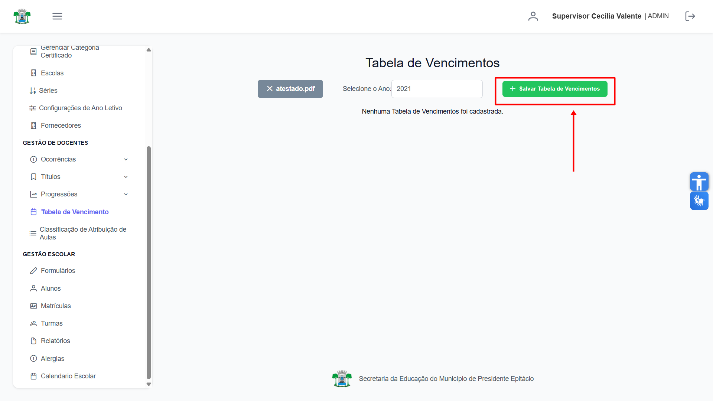
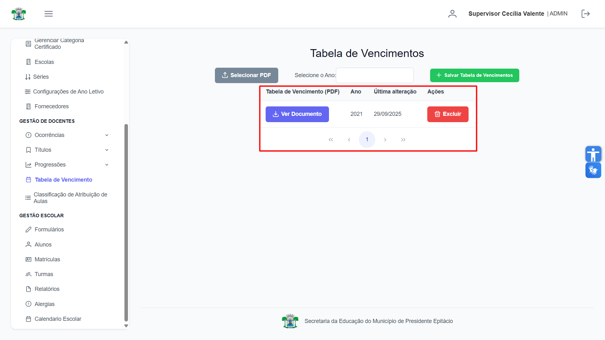
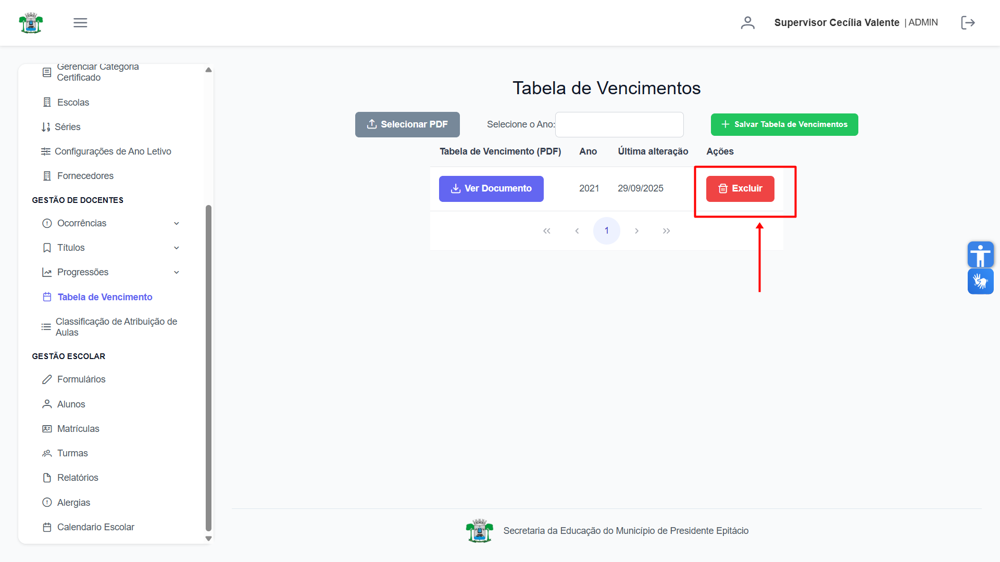
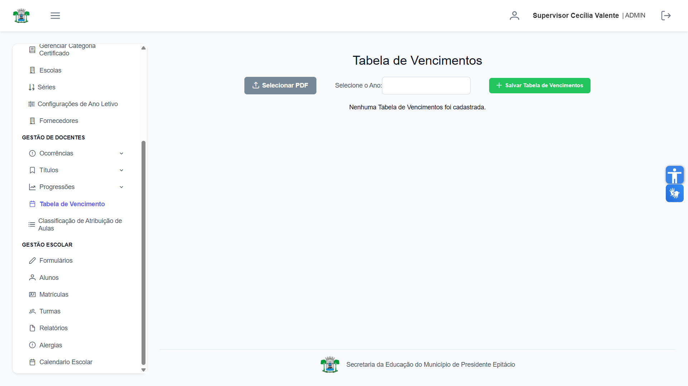

# Tabelas de Vencimento

Esta seção destina-se à consulta e ao gerenciamento das **Tabelas de Vencimento**. **Diretores e Docentes** têm permissão para visualizar as tabelas, enquanto o **Supervisor** é responsável por cadastrar e excluir os documentos.

## Visualizar Tabelas de Vencimento

A aba **"Tabela de Vencimento"** exibe a lista de todas as tabelas publicadas. Basta acessar a aba para consultar os documentos disponíveis.

## Cadastrar Tabela de Vencimento

Para o **Supervisor** é possível cadastrar as Tabelas de Vencimento. Primeiro, clicando no botão **"Selecionar PDF"** e escolhendo o arquivo correspondente em seu computador.

Selecione o **Ano** de vigência da tabela.

Com o arquivo e o ano definidos, clique em **"Salvar Tabela de Vencimento"** para concluir o envio.

Após o envio, o novo documento aparecerá na lista de tabelas disponíveis para consulta.

## Excluir Tabela de Vencimento

Para remover uma tabela, localize-a na lista e clique no botão vermelho **"Excluir"**.

Após a confirmação, a tabela será removida permanentemente do sistema e não estará mais visível para os usuários.
