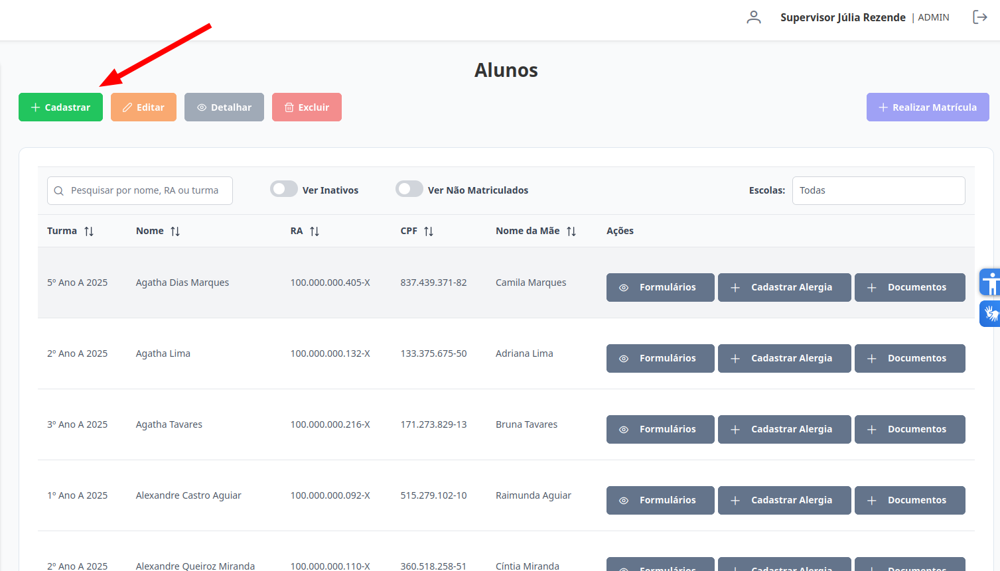
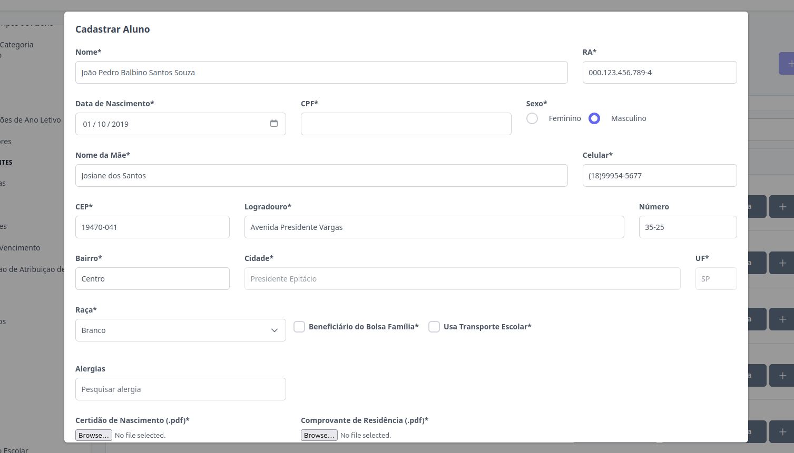
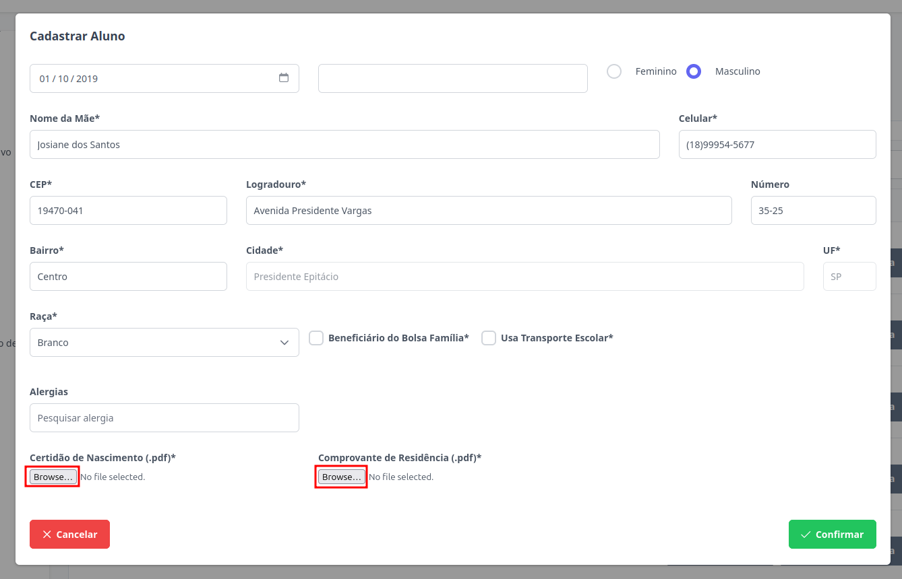
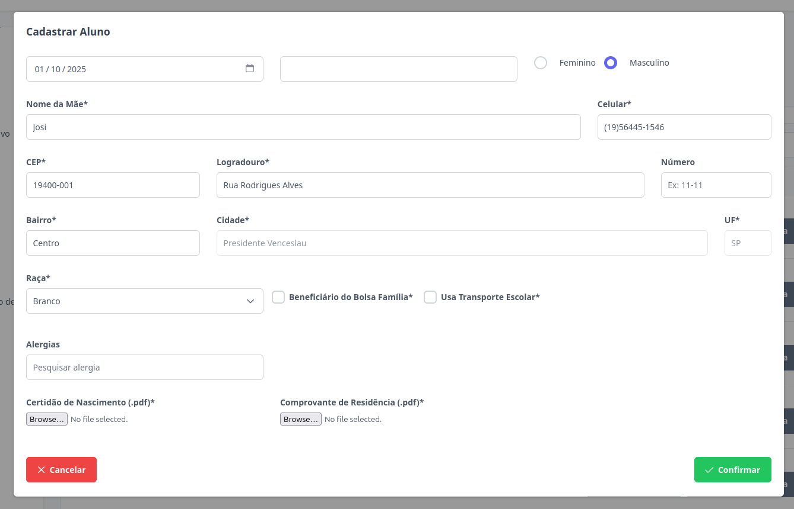
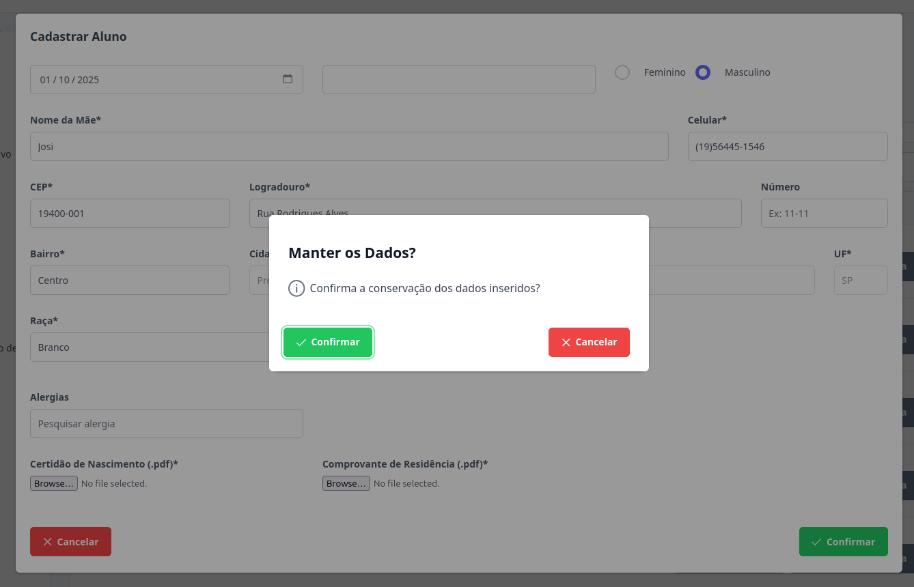

# Alunos
Esta seção permite o cadastro de novos alunos. Os níveis de **Supervisor**, **Diretor** e **Escriturário** estão autorizados para executar esta ação.

## Cadastrar Aluno

> 1. Para cadastrar um aluno clique no botão "Cadastrar".
>
> 2. Preencha todos os campos necessários. As únicas informações opcionais são: CPF, vínculo com o Bolsa Família e uso de transporte público. 
 Ao informar um CEP válido, aguarde alguns instantes para que os campos de Logradouro, Bairro, Cidade e UF sejam preenchidos automaticamente.  
>
> Envie a certidão de nascimento e o comprovante de residência em formato PDF. Certifique-se de que os arquivos estejam baixados e clique nos botões destacados abaixo para anexá-los.
>

> 3. Para finalizar o cadastro clique no botão "Confirmar". Caso não queira prosseguir com o cadastro, clique em "Cancelar".
>

> 4. Caso clique em "Cancelar", poderá salvar os dados já preenchidos por um tempo indeterminado clicando em "Confirmar". Ao reabrir o cadastro, as informações preenchidas estarão disponíveis. Caso não deseje manter os dados, clique em "Cancelar".
>

Pronto, o novo aluno foi cadastrado.
