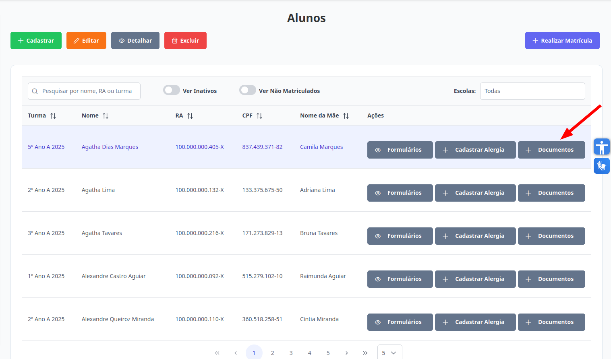
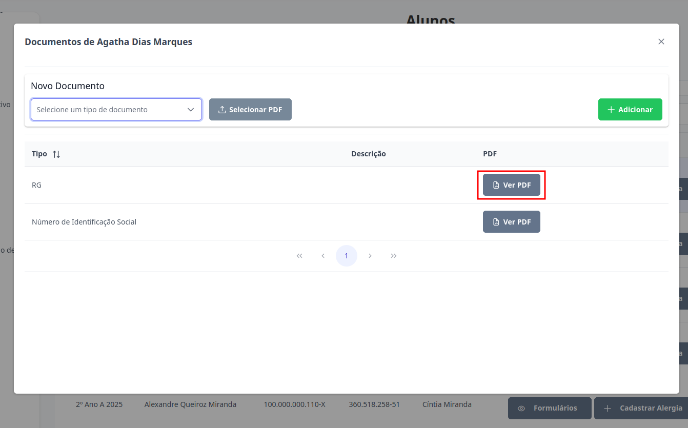
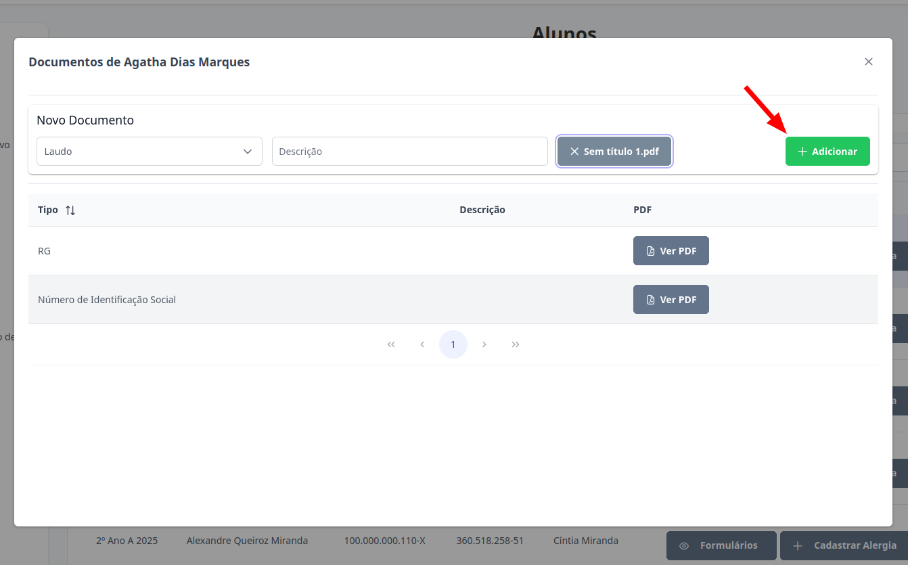
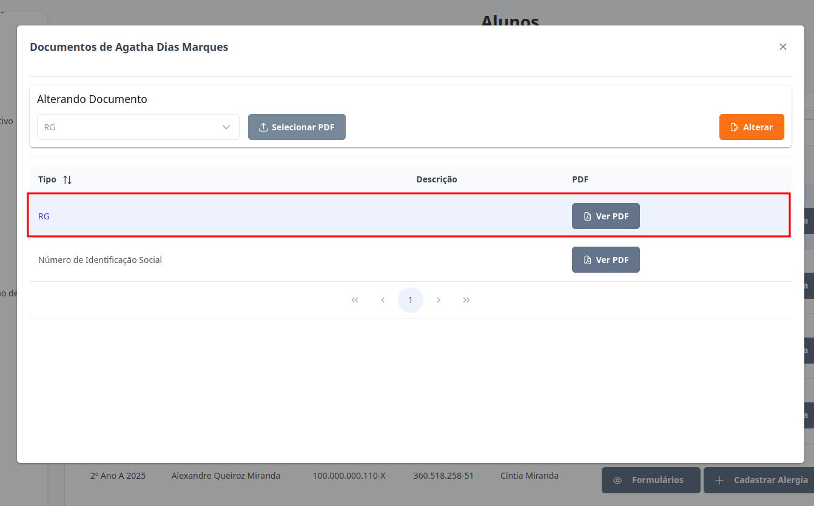
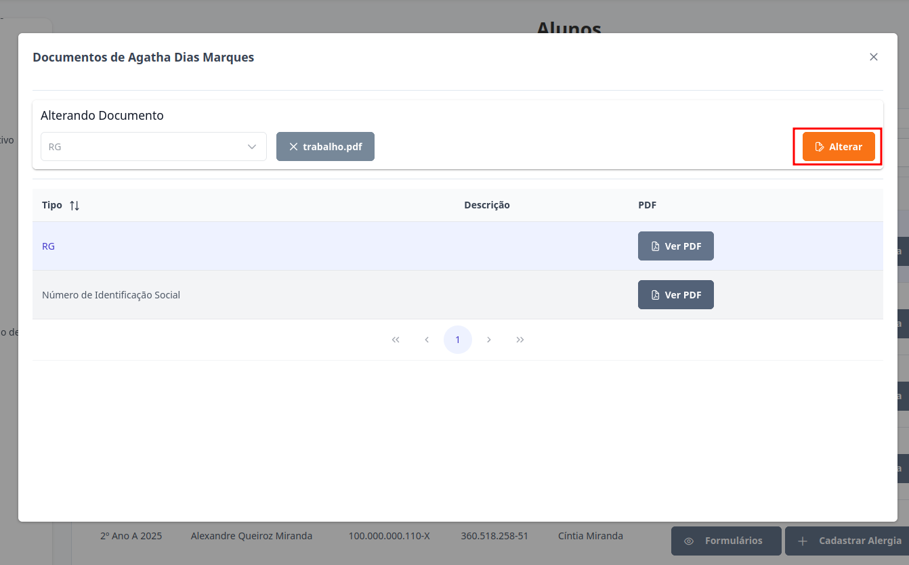
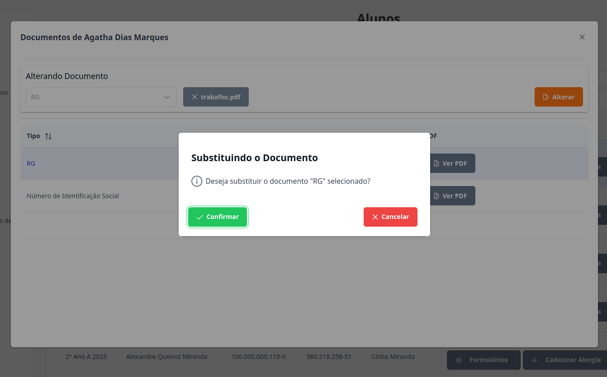

# Alunos
Esta seção permite visualizar ou anexar os documentos dos alunos. Os níveis de **Supervisor**, **Diretor** e **Escriturário** estão autorizados para executar esta ação.

## Visualizar Documentos

> 1. Para visualizar documentos de um aluno, selecione o aluno desejado e clique no botão "Documentos".
> 

> 2. Clique no botão "Ver PDF" destacado abaixo.
> 

## Anexar Documento

> 1. Para anexar o documento de um aluno, selecione o aluno desejado e clique no botão "Documentos".
> 

> 2. Selecione o tipo desejado, insira uma descrição (opcional) e escolha o arquivo no formato PDF. Certifique-se de que o arquivo já esteja baixado em seu dispositivo e clique no botão "Adicionar", destacado abaixo, para concluir o envio.
>  

> Pronto, o documento foi adicionado para o aluno.

## Alterar Documentos

> 1. Para alterar o documento de um aluno, selecione o aluno desejado e clique no botão "Documentos".
> 

> 2. Selecione o documento que deseja modificar. Ao fazer isso, o botão "Adicionar" será substituído por "Alterar".
> 

> 3. Selecione o arquivo no formato PDF. Certifique-se de que o arquivo já esteja baixado em seu dispositivo e clique no botão "Alterar", destacado abaixo, para concluir o envio.
> 

> 4. Para finalizar a alteração, clique no botão "Confirmar". Caso não queira prosseguir com o cadastro, clique em "Cancelar".
> 

> Pronto, o documento do aluno foi alterado.