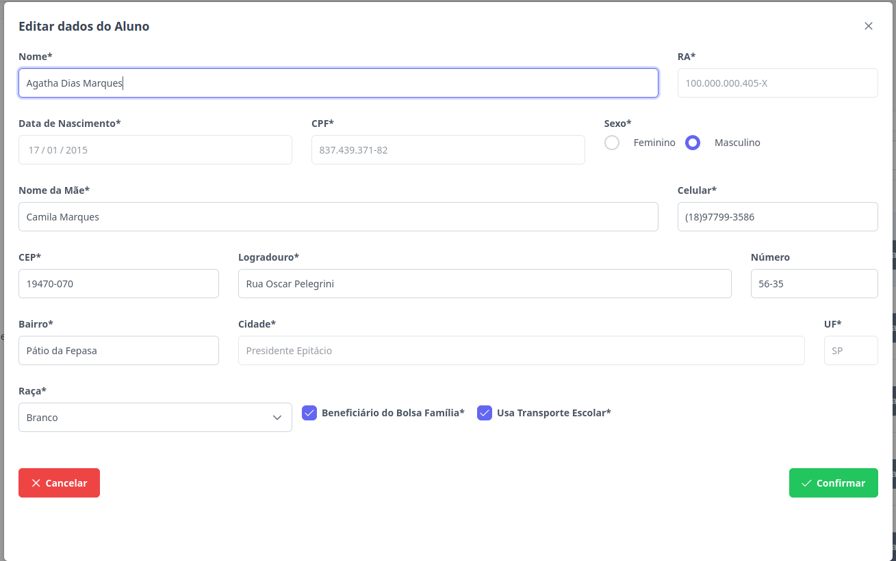

# Alunos
Esta seção permite a edição de alunos. Os níveis de **Supervisor**, **Diretor** e  **Escriturário** estão autorizados para executar esta ação.

## Cadastrar Aluno

> 1. Para editar, selecione o aluno desejado e clique no botão "Editar".
>
    
> 2. Atualize os campos desejados. As únicas informações opcionais são: CPF, vínculo com o Bolsa Família e uso de transporte público. Caso o aluno já possua um CPF cadastrado, essa informação não poderá ser alterada.
>
> Ao informar um CEP válido, aguarde alguns instantes para que os campos de Logradouro, Bairro, Cidade e UF sejam preenchidos automaticamente.
>

> 3. Para finalizar a edição clique no botão "Confirmar". Caso não queira prosseguir com o cadastro, clique em "Cancelar".

Pronto, o aluno foi editado.
