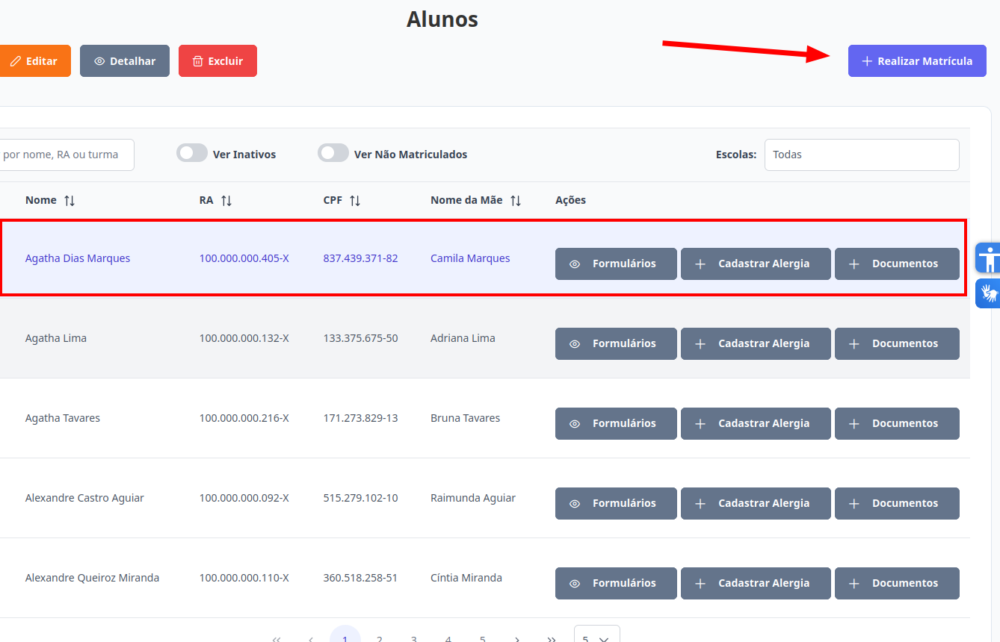

# Alunos
Esta seção permite realizar a matrícula de alunos no sistema. Os perfis de **Supervisor**, **Diretor** e **Escriturário** estão autorizados a executar essa ação.

## Realizar Matrícula do Aluno

> Para efetuar a matrícula, selecione um aluno e clique no botão "Realizar Matrícula" e acesse: [Matricular Aluno](../matriculas/realizar-matricula.md).     
>