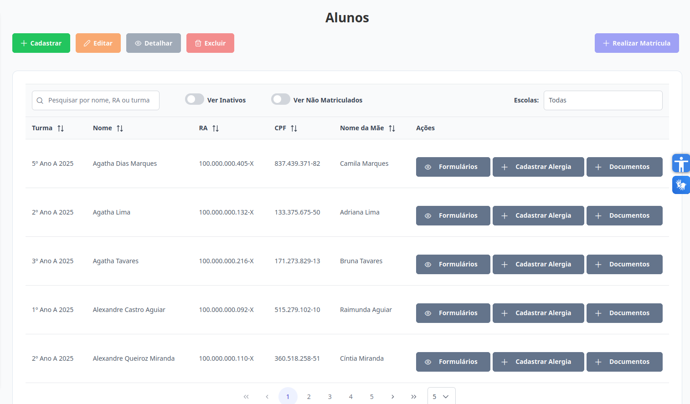
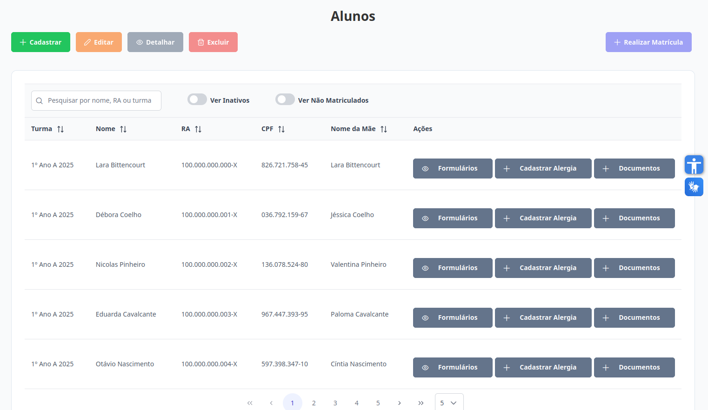
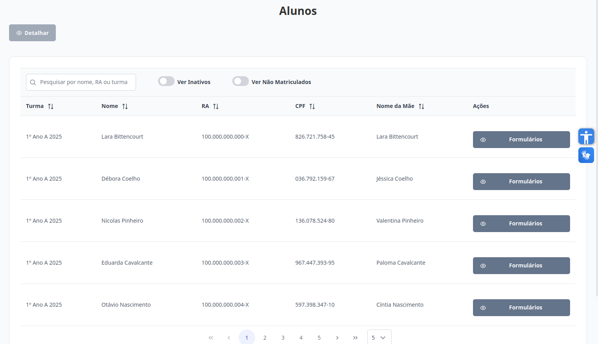
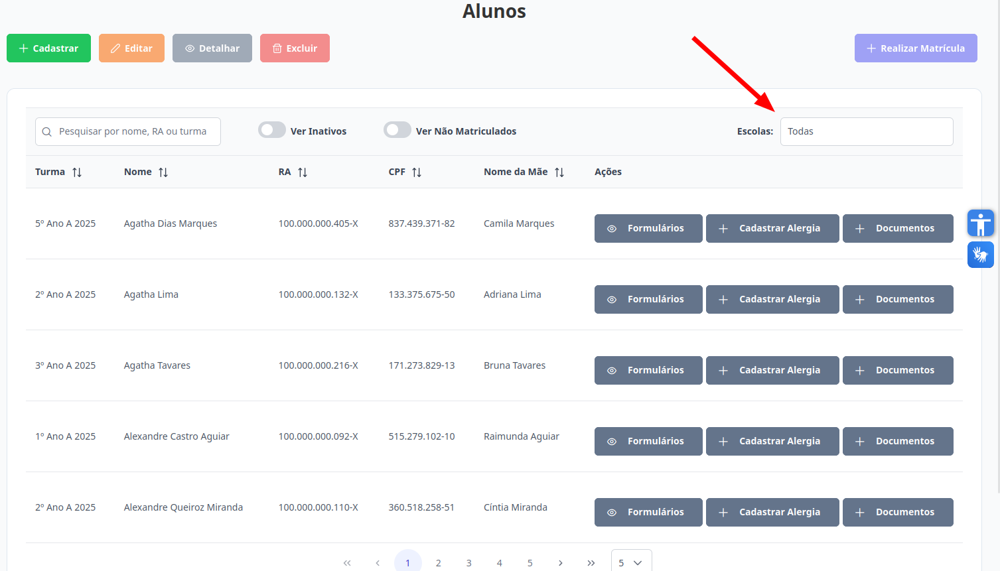
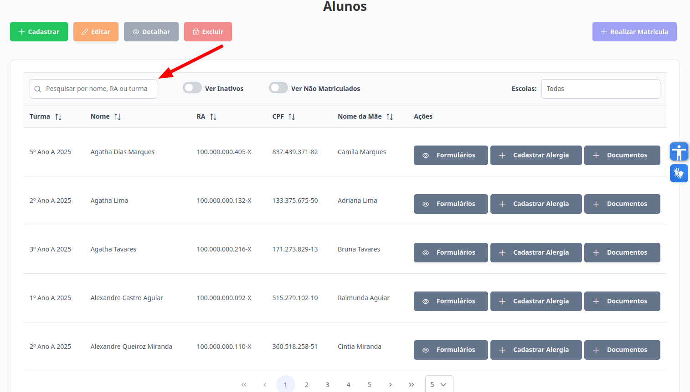
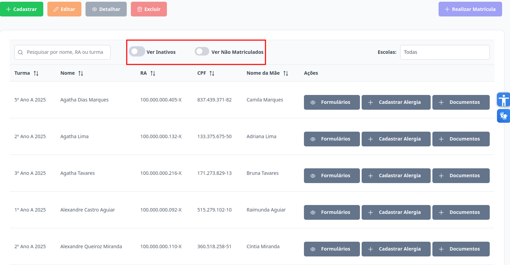

# Alunos
Esta seção permite a visualização dos alunos. O acesso é permitido para os níveis de **Supervisor**, **Diretor**, **Escriturário** e **Coordenador**.

## Visualizar Alunos

Na aba de "Alunos", esta é a visualização de todos os alunos para o **Supervisor**: 

Na aba de "Alunos", esta é a visualização de todos os alunos para o **Diretor** e **Escriturário**: 

Na aba de "Alunos", esta é a visualização de todos os alunos para o **Coordenador**: 

O **Supervisor** pode filtrar alunos de uma escola específica.

Para localizar um aluno específico, utilize o campo de pesquisa, que permite buscar pelo seu nome, RA ou turma.

Para visualizar os alunos inativos ou não matriculados, basta habilitar os campos indicados na imagem abaixo.

## Ações disponíveis:

[Cadastrar Aluno](./cadastrar-aluno.md): permite incluir um novo aluno no sistema.

[Editar Aluno](./editar-aluno.md): possibilita a atualização de um aluno existente.

[Excluir Aluno](./excluir-aluno.md): remove um aluno do sistema de forma definitiva.

[Realizar Matrícula](./realizar-matricula.md): permite matricular um aluno em uma turma.

[Visualizar Respostas de Formulários](./visualizar-formularios.md): exibe os formulários respondidos para determinado aluno.

[Visualizar ou Anexar Documentos](./documentos.md): possibilita a visualização e o anexo de documentos para um aluno.