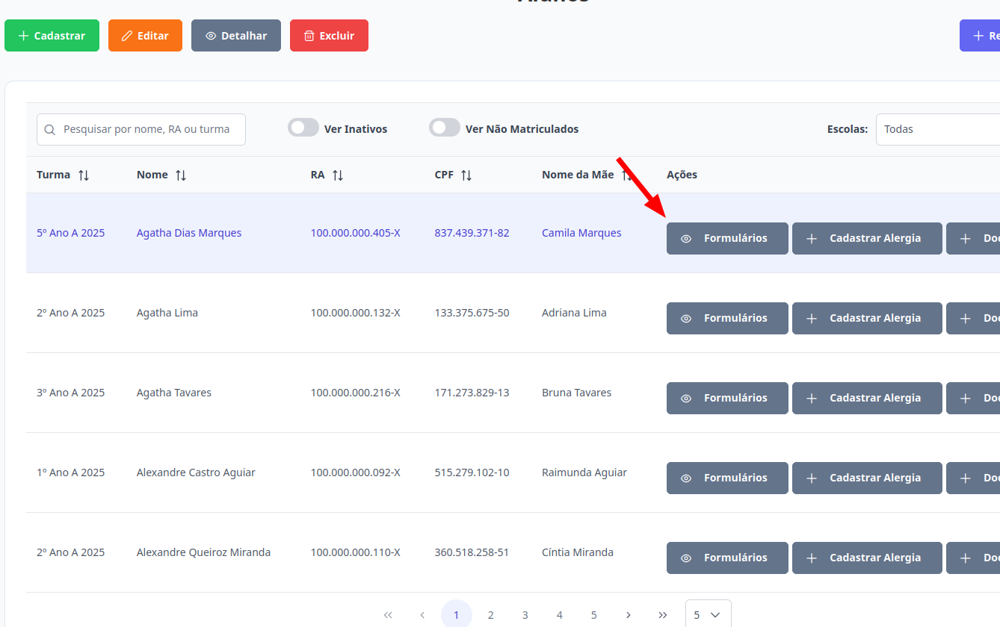
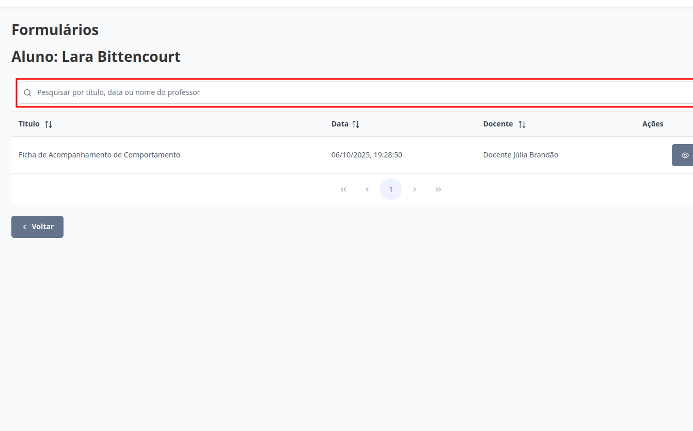
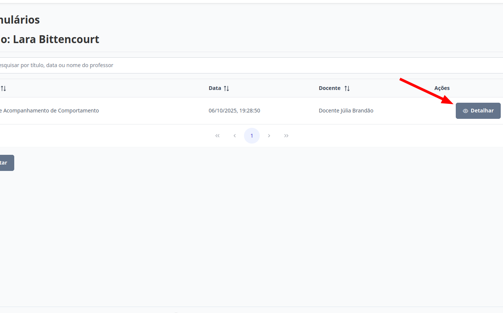

# Alunos
Esta seção permite visualizar os formulários respondidos para os alunos. Os níveis de **Supervisor**, **Diretor**, **Escriturário** e **Coordenador** estão autorizados para executar esta ação.

## Visualizar Respostas de Formulários

> 1. Para visualizar as respostas dos formulários de um aluno, selecione o aluno desejado e clique no botão "Formulários".
> 
> Todos os formulários respondidos para o aluno serão exibidos na página abaixo. Para localizar um formulário específico, utilize o campo de pesquisa, que permite buscar por título, data ou nome do professor responsável pela resposta.
> 
>
> 2. Para visualizar os dados de um determinado formulário, selecione-o e clique em "Detalhar'".
> 