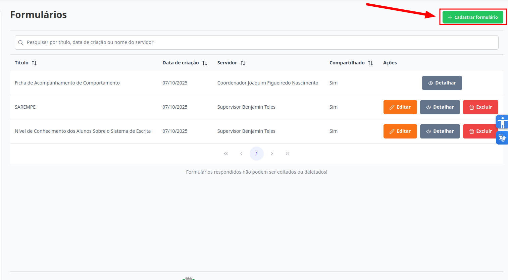
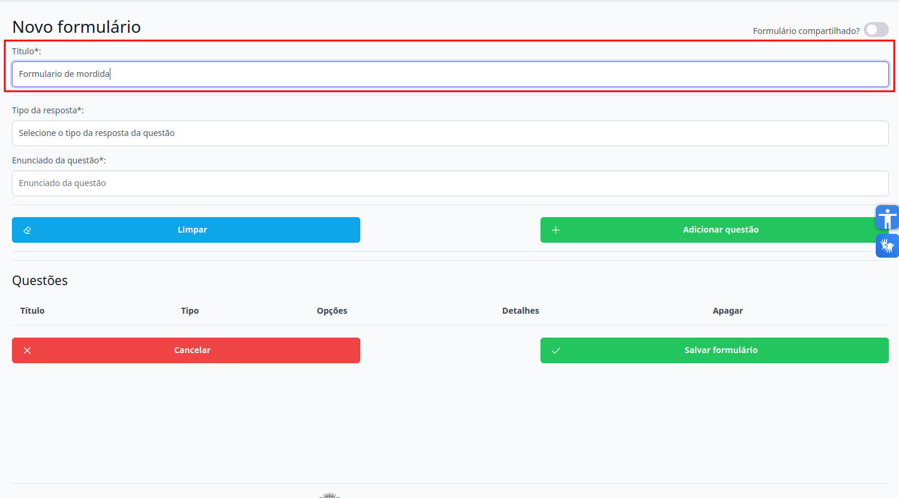
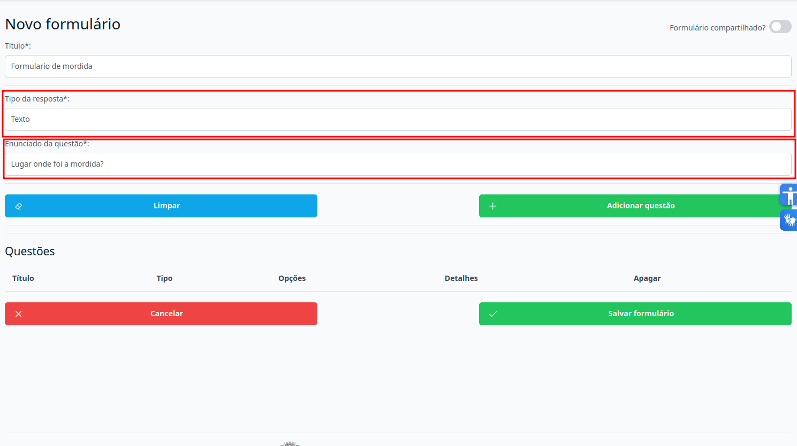
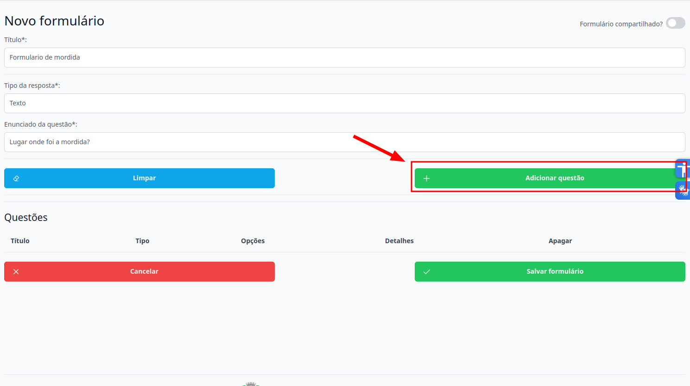
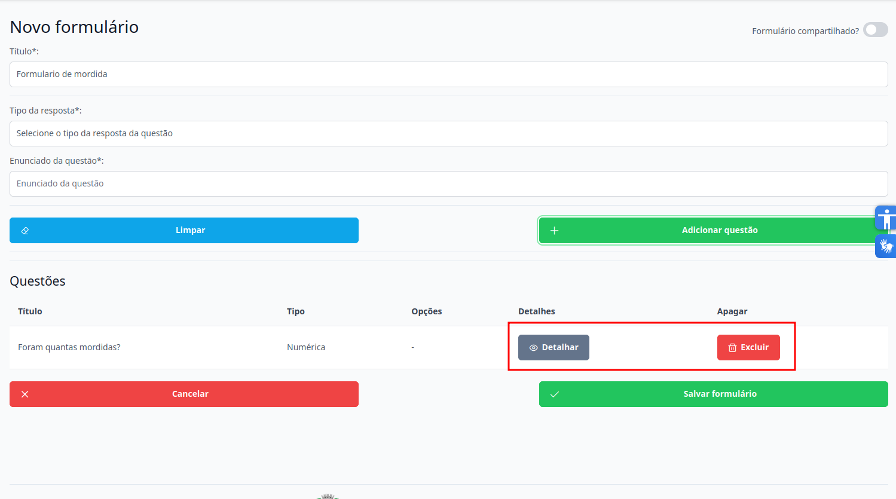
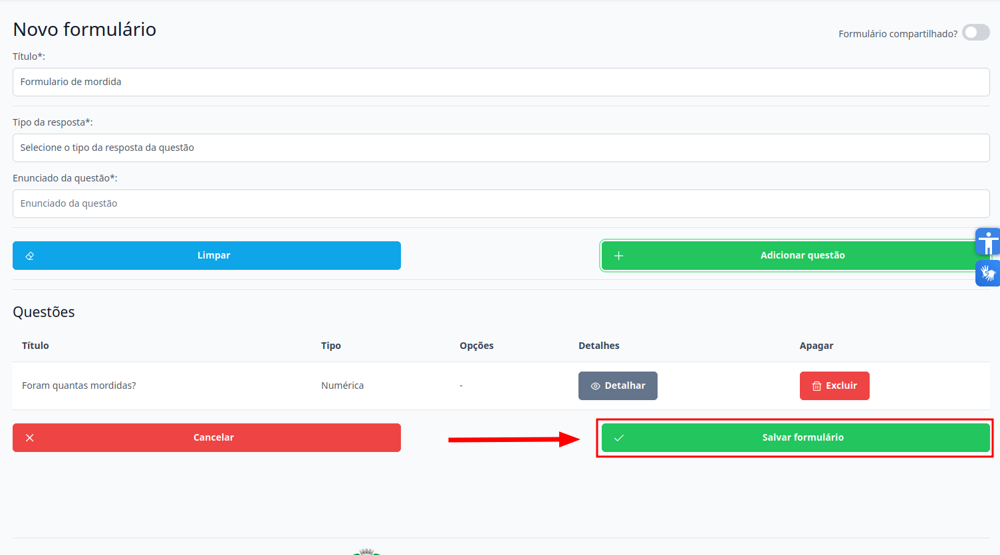

# Formulários
Esta seção permite o cadastro de novos formulários. Os níveis de **Supervisor** e **Coordenador** estão autorizados para executar esta ação.

## Cadastrar Formulário

> 1. Para cadastrar um formulário clique no botão "Cadastrar formulário".
> 
    
> 2. Preencha o título do Formulário.
> 

> 3. Para inserir uma nova questão, selecione primeiro o tipo de resposta desejado (ex: múltipla escolha, verdadeiro ou falso, entre outras). Em seguida, insira o enunciado que será apresentado aos usuários.
> 

> 4. Para adicionar a questão, clique no botão "Adicionar questão". Caso deseje descartar o conteúdo preenchido, clique em "Limpar" e os campos serão esvaziados automaticamente.

> 5. Para adicionar novas questões, repita os passos 3 e 4 quantas vezes forem necessárias. 
>
> 6. Para detalhar ou excluir uma questão específica após sua adição, clique no botão correspondente: "Detalhar" para visualizar os detalhes da questão ou "Excluir" para removê-la.
> 
>
> 7. Para salvar os dados inseridos, clique em "Salvar Formulário". Caso não deseje prosseguir, clique em "Cancelar".
> 

Pronto, o formulário foi cadastrado.
