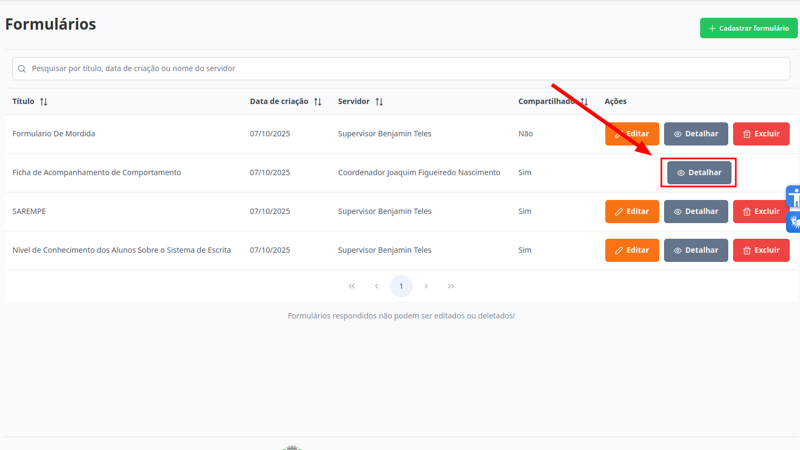
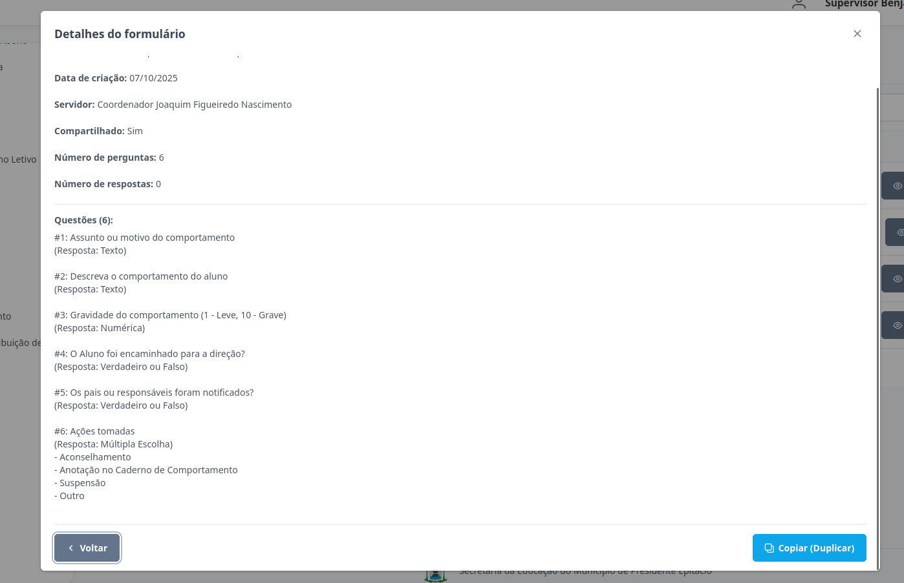

# Formulários
Esta seção permite o detalhamento de formulários. Os níveis de **Supervisor**, **Diretor**, **Escriturário** e **Coordenador** estão autorizados para executar esta ação.

## Detalhar Formulário

> 1. Para detalhar um formulário clique no botão "Detalhar".
> 
    
> 2. As informações relacionadas ao item selecionado serão exibidas na tela. Caso deseje apenas visualizá-las, clique no botão "Voltar" para retornar à página anterior.
> 

> 3. Para clonar um formulário, clique no botão "Copiar (Duplicar)". Um novo formulário será gerado com as mesmas perguntas do original. A partir desse ponto, siga os procedimentos descritos em: [Cadastrar Formulário](../formularios/cadastrar-formulario.md).   