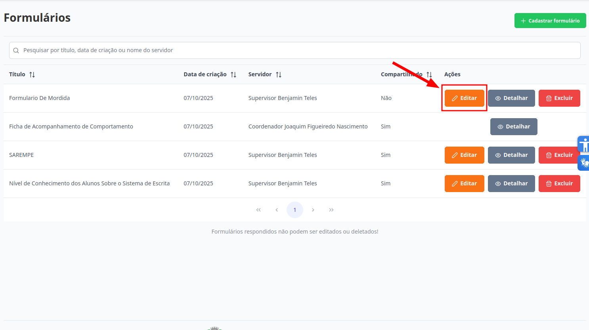

# Formulários
Esta seção permite a edição de formulários que ainda não tenham respostas associadas a ele. Somente o criador do formulario consegue executar esta ação.

## Editar Formulário

> 1. Para editar, selecione o formulário desejado e clique no botão "Editar".
> 

> 2. Todos os passos necessários são abordados em: [Cadastrar Formulário](../formularios/cadastrar-formulario.md).  
