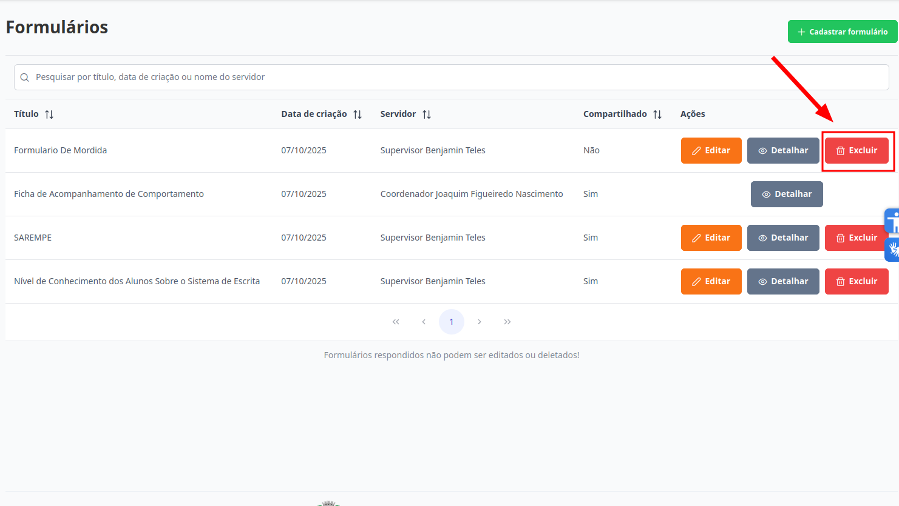
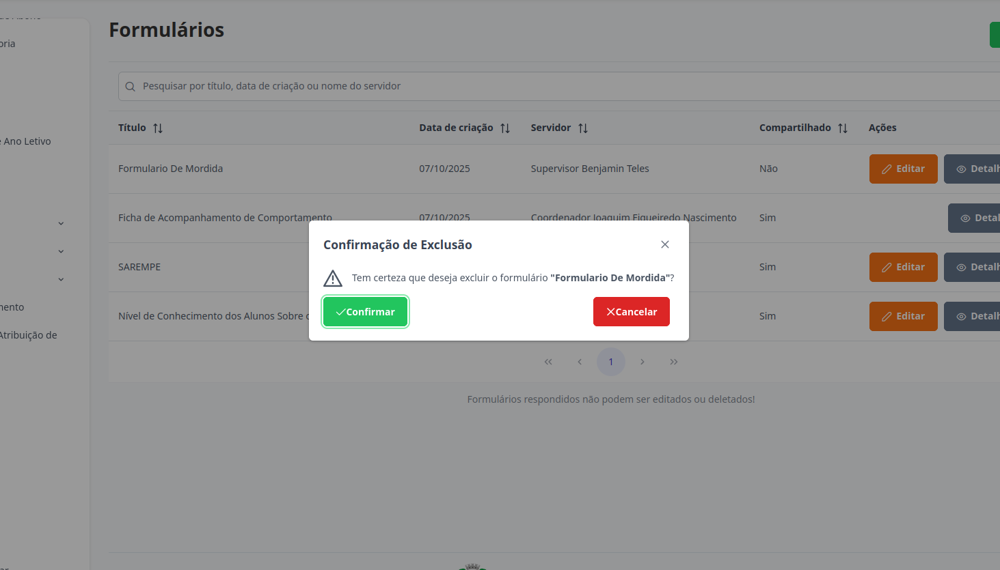

# Formulários
Esta seção permite a exclusão de formulários que ainda não tenham respostas associadas a ele. Somente o criador do formulario consegue executar esta ação.

## Excluir Formulário

> 1. Para excluir, selecione o formulário desejado e clique no botão "Excluir".
> 

> 2. Para concluir a ação clique no botão "Confirmar". Caso Contrário, clique em "Cancelar".
> 

Pronto, o formulário foi excluído.