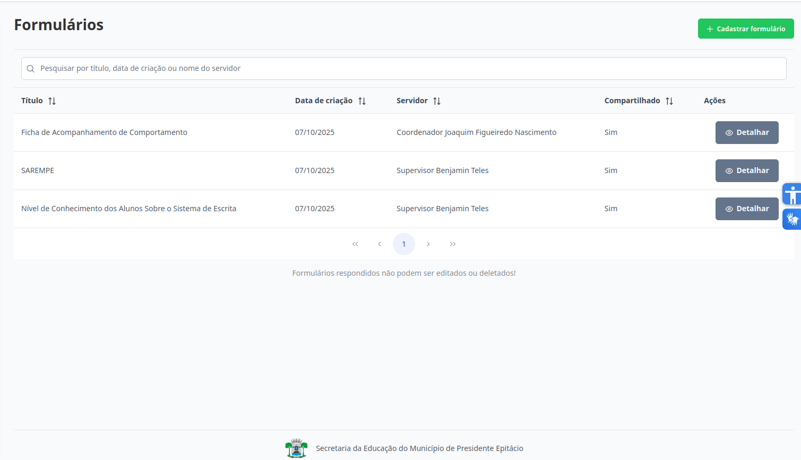
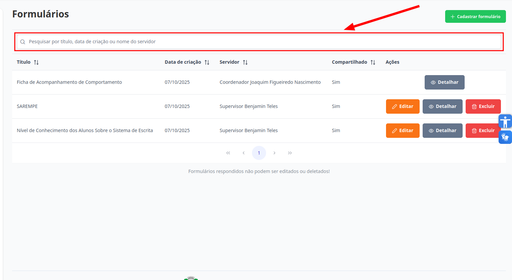

# Formulários
Esta seção permite o acesso aos formulários. Todos os níveis de acesso têm permissão para consultá-los, embora o tipo de acesso possa variar conforme o nível.

## Visualizar Formulários

Na aba de "Formulários", esta é a visualização de todos os formulários para o **Supervisor**, **Coordenador**, **Diretor** e **Escriturário**: 

<!-- Na aba de "Formulários", esta é a visualização de todos os formulários para o **Professor**: 
DEPOIS FALAR SOBRE -->

Para localizar um formulário específico, utilize o campo de pesquisa, que permite buscar pelo seu título, data de criação ou servidor responsável.

## Ações disponíveis:

[Cadastrar Formulário](./cadastrar-formulario.md): permite incluir um novo formulário no sistema.

[Editar Formulário](./editar-formulario.md): possibilita a atualização de um formulário existente.

[Excluir Formulário](./excluir-formulario.md): remove um formulário do sistema de forma definitiva.

[Detalhar Formulário](./detalhar-formulario.md): exibe as informações de determinado formulário.

[Visualizar Respostas](./excluir-formulario.md): possibilita a visualização das respostas de determinado formulário.

