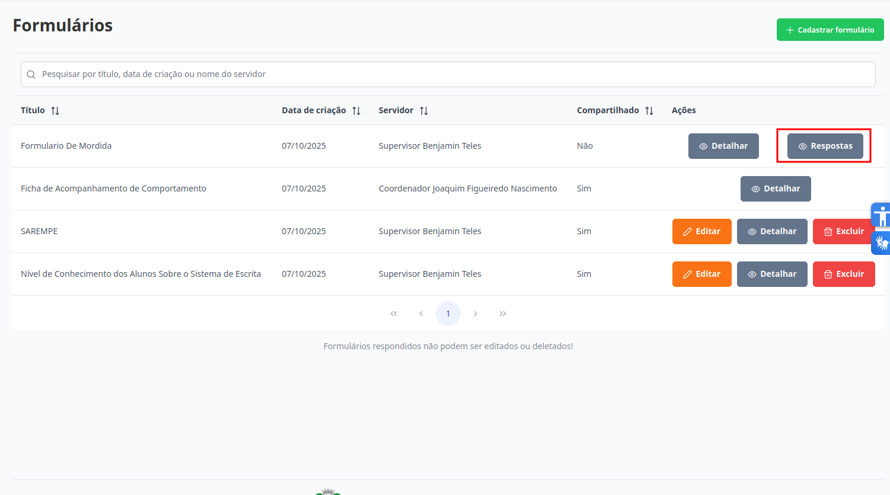
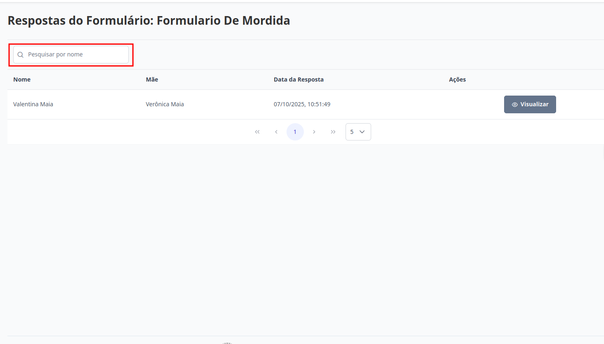
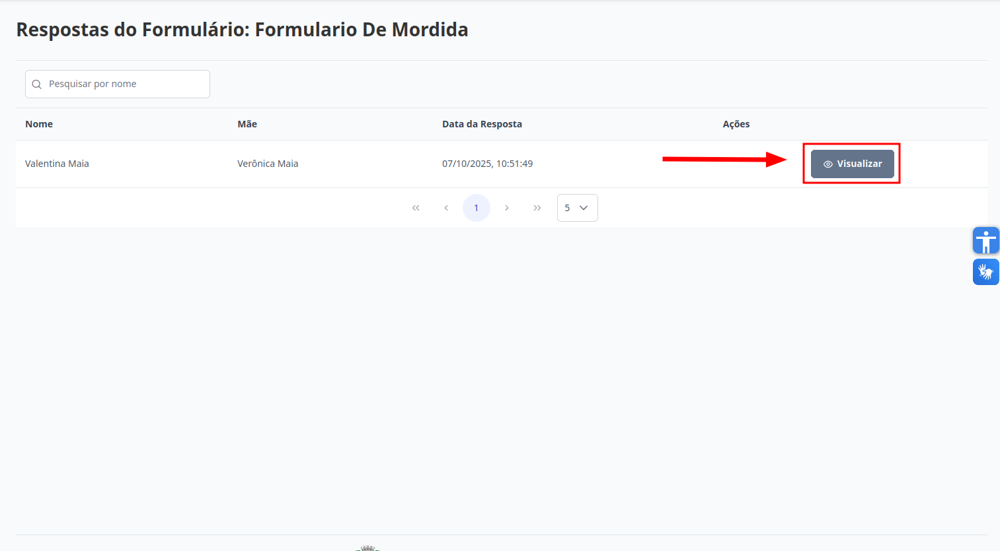

# Formulários
Esta seção permite visualizar as respostas para determinado formulário. Os níveis de **Supervisor**, **Diretor**, **Escriturário** e **Coordenador** estão autorizados para executar esta ação.

## Visualizar Respostas de Formulários

> 1. Para visualizar as respostas dos formulários, selecione o formulário desejado e clique no botão "Respostas". ***Importante***: O botão respostas só estará disponivel se pelo houver pelo menos uma resposta
> 
> Todos os formulários já respondidos serão exibidos na página abaixo. Para localizar uma resposta específica, utilize o campo de pesquisa, que permite buscar pelo nome do aluno associado ao formulário.
> 
>
> 2. Para visualizar as informações de uma determinada resposta, clique em "Visualizar'".
> 
