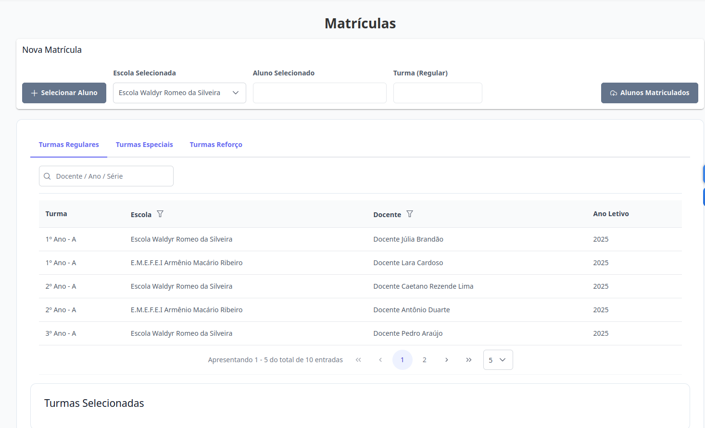
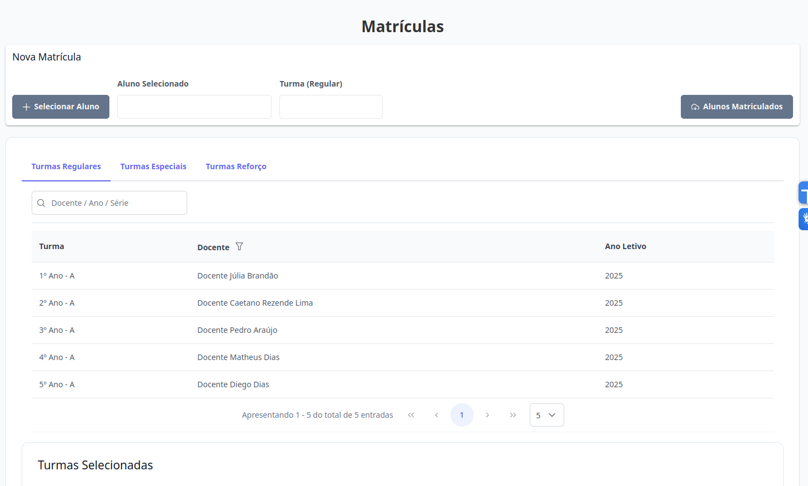
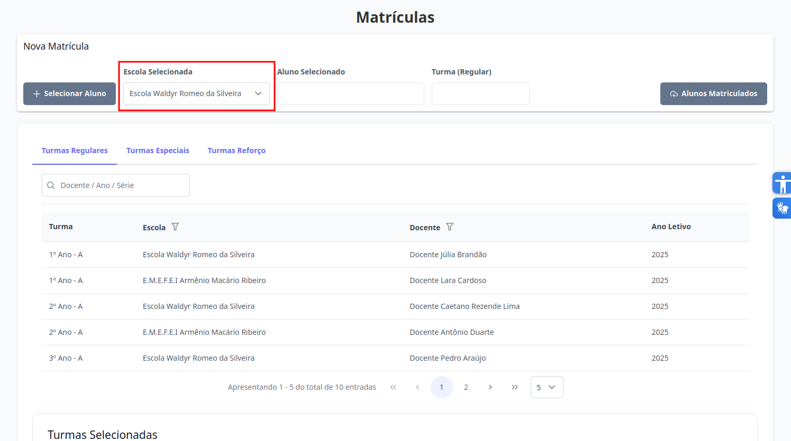
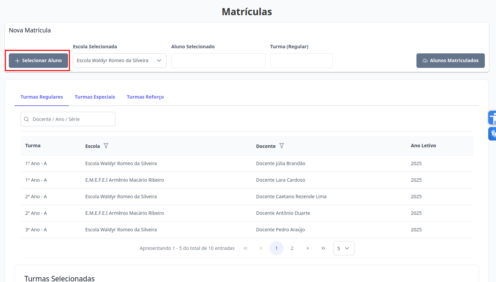
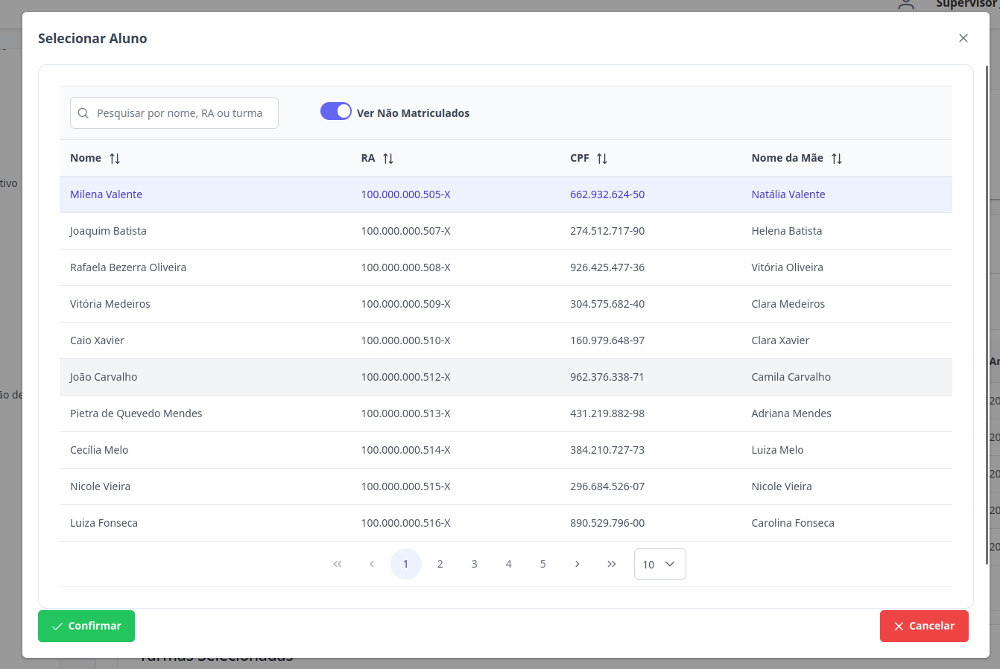
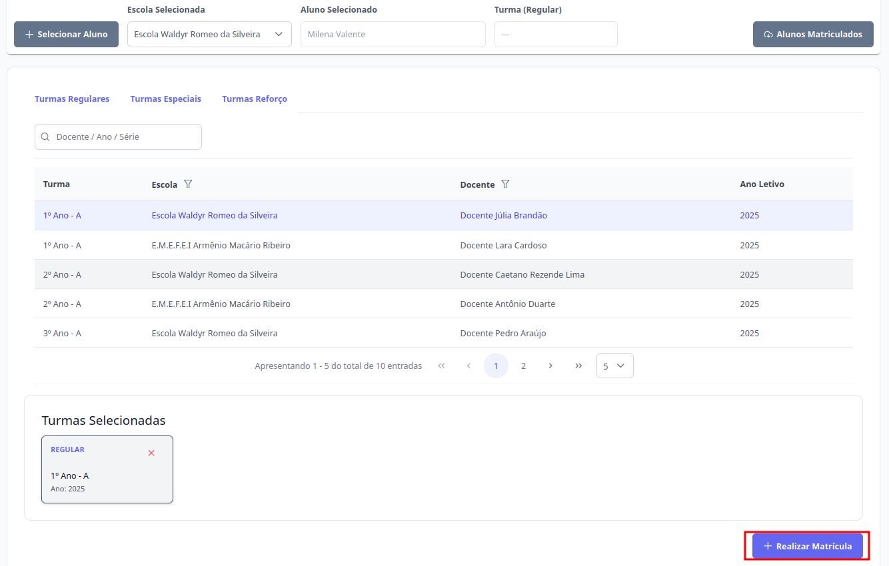

# Matrículas
Esta seção permite matricular um aluno em uma ou mais turmas. Os níveis de **Supervisor**, **Diretor** e **Escriturário** estão autorizados para executar esta ação.

## Matricular Aluno

Na aba de "Matrículas", esta é a visualização para o **Supervisor**: 

Na aba de "Matrículas", esta é a visualização para o **Diretor** e **Escriturário**: 

> 1. Para que o perfil de **Supervisor** possa matricular um aluno, é necessário selecionar a escola inicialmente. A partir desse ponto, o processo de matrícula segue o mesmo fluxo para todos os níveis de acesso.  
> 
> Clique em selecionar aluno, escolha um aluno e clique em confirmar
> 
> 
> Selecione o aluno desejado. Um aluno só pode ser matriculado em uma turma se não estiver vinculado a outra do mesmo tipo.  
**Por exemplo**: não será possível cadastrá-lo em uma Turma Regular caso já esteja matriculado em outra do mesmo tipo. Nesse caso, será necessário realizar a desvinculação antes de associá-lo à nova turma.
    
> 2. Com o aluno selecionado, escolha as turmas desejadas de cada tipo (Regular, Especial e Reforço) clicando sobre elas. Em seguida, clique no botão "Realizar Matrícula" para concluir o processo. Caso queira remover alguma turma, basta clicar no ícone "X" correspondente antes de efetuar a matrícula.
> 

> Pronto, a matrícula do aluno foi realizada.