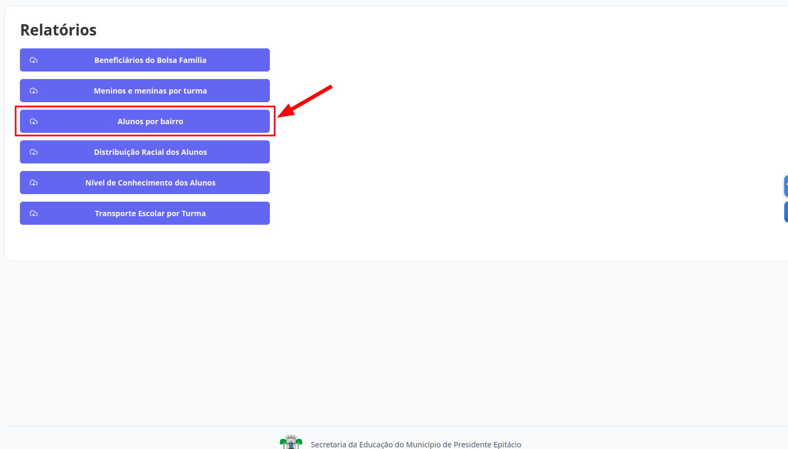
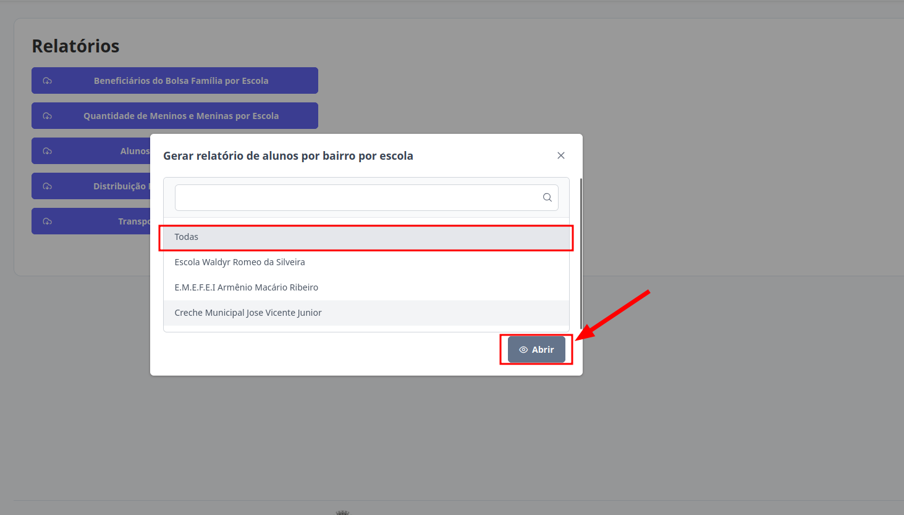

# Relatórios
Esta seção permite o acesso aos Relatórios. Os níveis de **Supervisor**, **Diretor** e **Escriturário** estão autorizados a realizar essa ação.

## Relatório de Alunos por Bairro

O perfil de **Supervisor** tem acesso à lista completa de alunos por bairro vinculados a todas as escolas, podendo também consultar os dados de uma escola específica, conforme necessário.

Os níveis de **Diretor** e **Escriturário** têm acesso à lista de alunos por bairro vinculados exclusivamente à sua escola.

> 1. Clique no botão "Alunos por Bairro".
> 

> 2. Selecione a opção desejada e clique em "Abrir"
> 

> Pronto, o relatório estará disponível.
