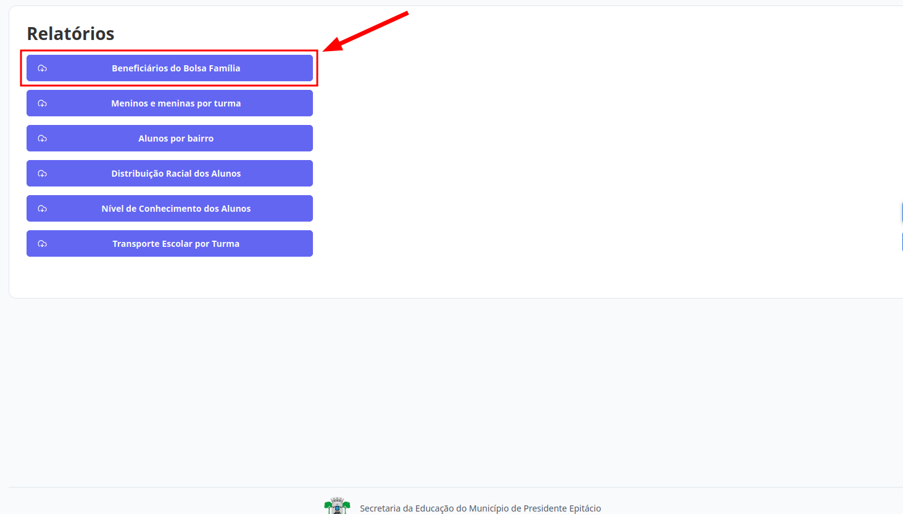
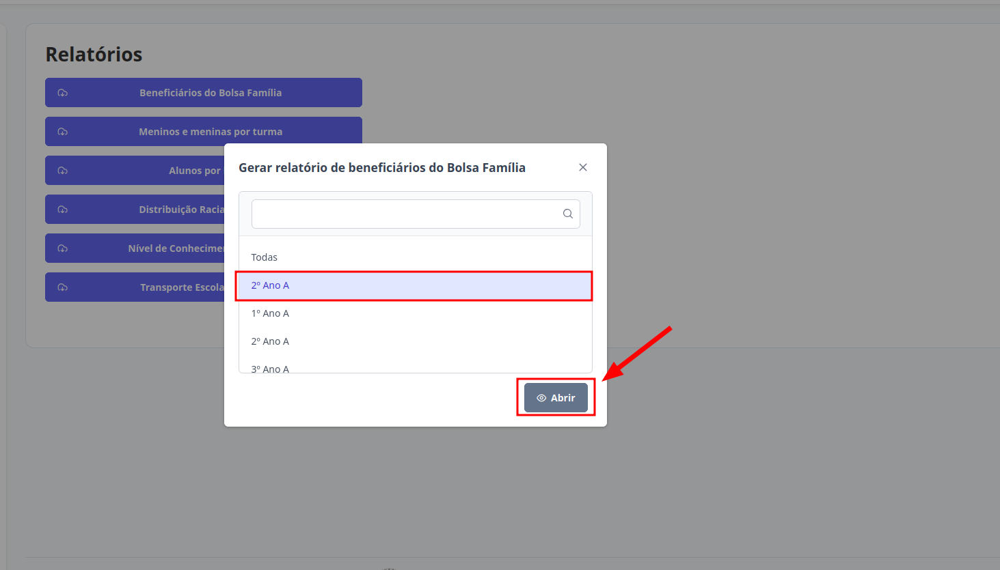

# Relatórios
Esta seção permite o acesso aos Relatórios. Os níveis de **Supervisor**, **Diretor** e **Escriturário** estão autorizados a realizar essa ação.

## Relatório de Beneficiários do Bolsa Família

Este relatório é disponibilizado por unidade escolar. O perfil de **Supervisor** têm acesso à lista completa de beneficiários vinculados à todas as escolas, podendo também consultar os dados de uma escola específica, conforme necessário. 

Os níveis de **Diretor** e **Escriturário** têm acesso à lista completa de beneficiários vinculados à sua escola, podendo também consultar os dados de uma turma específica, conforme necessário.

> 1. Clique no botão "Relatório de Beneficiários do Bolsa Família".
> 

> 2. Selecione a opção desejada e clique em "Abrir"
> 

> Pronto, o relatório estará disponível.
