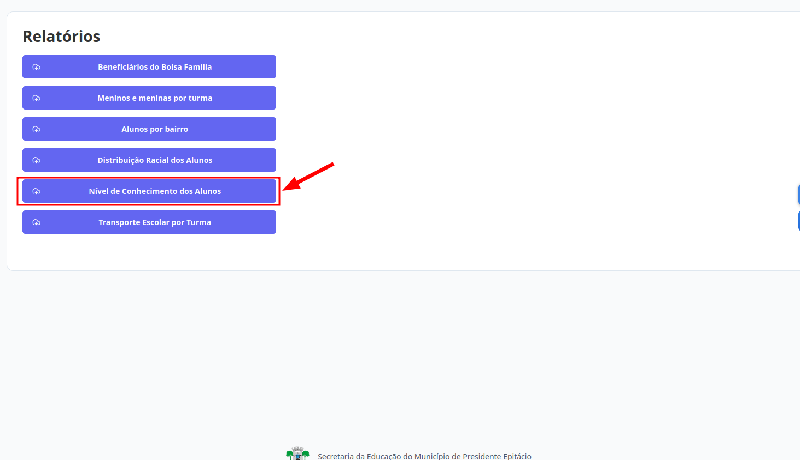
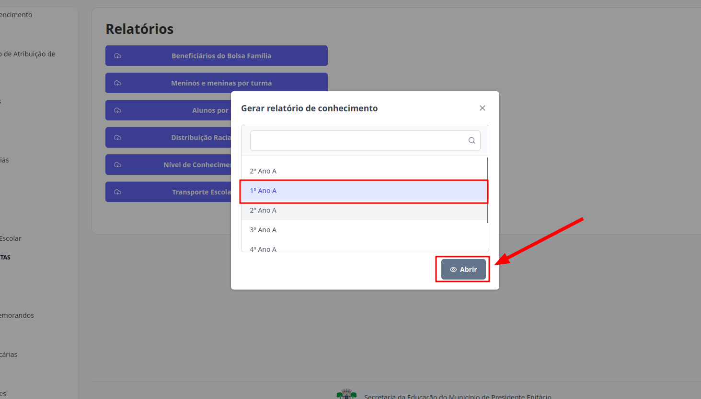

# Relatórios
Esta seção permite o acesso aos Relatórios. Os níveis de **Diretor** e **Escriturário** estão autorizados a realizar essa ação.

## Relatório de Nível de Conhecimento

Apenas os níveis de **Diretor** e **Escriturário** têm acesso a esse relatório. Para consultá-lo, é necessário selecionar previamente a turma sobre a qual desejam obter informações.

> 1. Clique no botão "Nível de Conhecimento dos Alunos".
> 

> 2. Selecione a opção desejada e clique em "Abrir"
> 

> Pronto, o relatório estará disponível.
