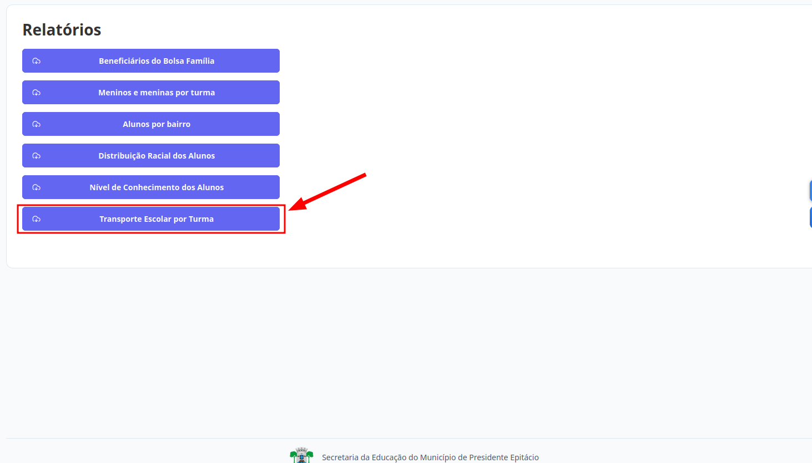
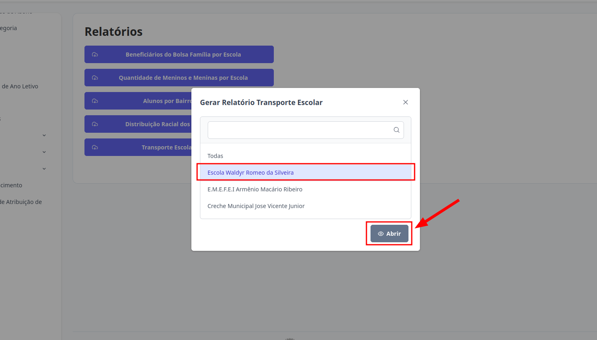

# Relatórios
Esta seção permite o acesso aos Relatórios. Os níveis de **Supervisor**, **Diretor** e **Escriturário** estão autorizados a realizar essa ação.

## Relatório de Transporte Escolar

Este relatório é disponibilizado por unidade escolar e apresenta a lista de alunos vinculados ao transporte escolar. O perfil de **Supervisor** têm acesso à relação completa de alunos de todas as escolas que utilizam o serviço, podendo também consultar os dados de uma escola específica, conforme necessário.

Os níveis de **Diretor** e **Escriturário** têm acesso à relação completa de alunos de todas as turmas que utilizam o serviço, podendo também consultar os dados de uma turma específica, conforme necessário.

> 1. Clique no botão "Relatório de Transporte Escolar".
> 

> 2. Selecione a opção desejada e clique em "Abrir"
> 

> Pronto, o relatório estará disponível.
