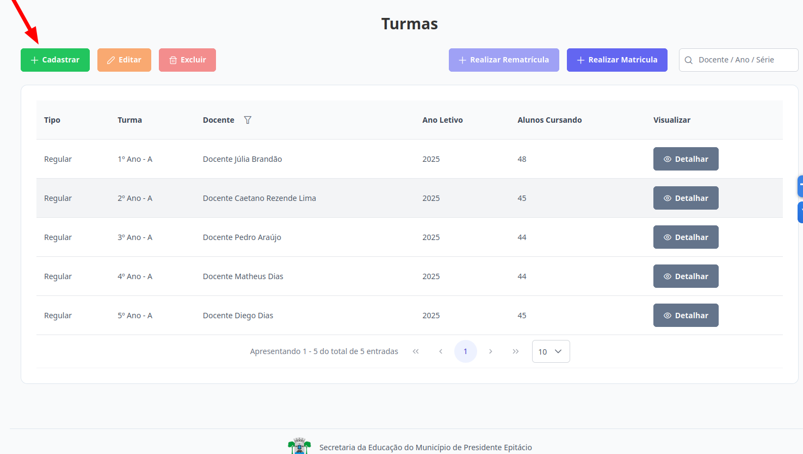
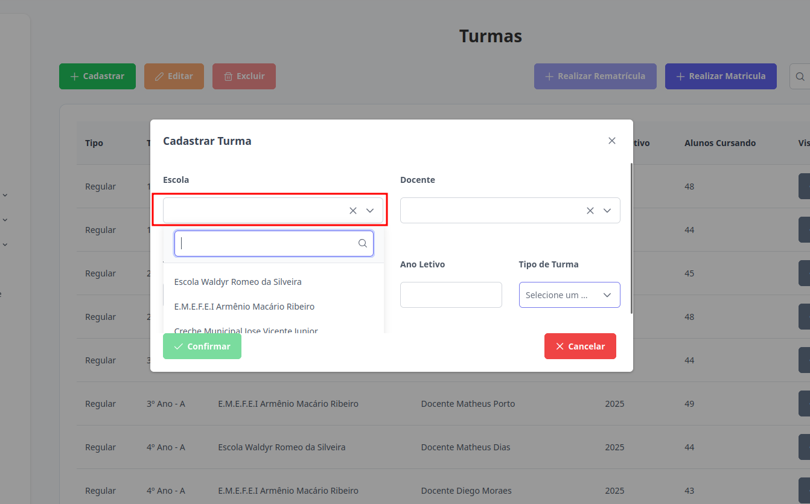
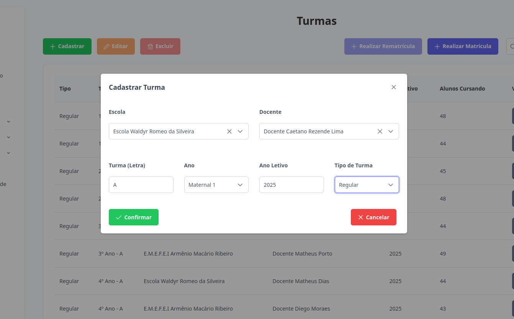

# Turmas
Esta seção permite o cadastro de novas turmas. Os níveis de **Supervisor**, **Diretor** e **Escriturário** estão autorizados para executar esta ação.

## Cadastrar Turma

> 1. Para cadastrar uma turma clique no botão "Cadastrar".
> 
    
> 2. Para que o perfil de **Supervisor** possa cadastrar uma turma, é necessário selecionar a escola inicialmente. A partir desse ponto, o processo de cadastro segue o mesmo fluxo para todos os níveis de acesso autorizados.
> 

> 3. Preencha todos os campos. Um professor só pode ser responsável por uma turma se não houver outra associada a ele no mesmo ano letivo. Para finalizar o cadastro, clique no botão "Confirmar". Caso não deseje prosseguir, clique em "Cancelar".
> 

>Pronto, a nova turma foi cadastrada.
