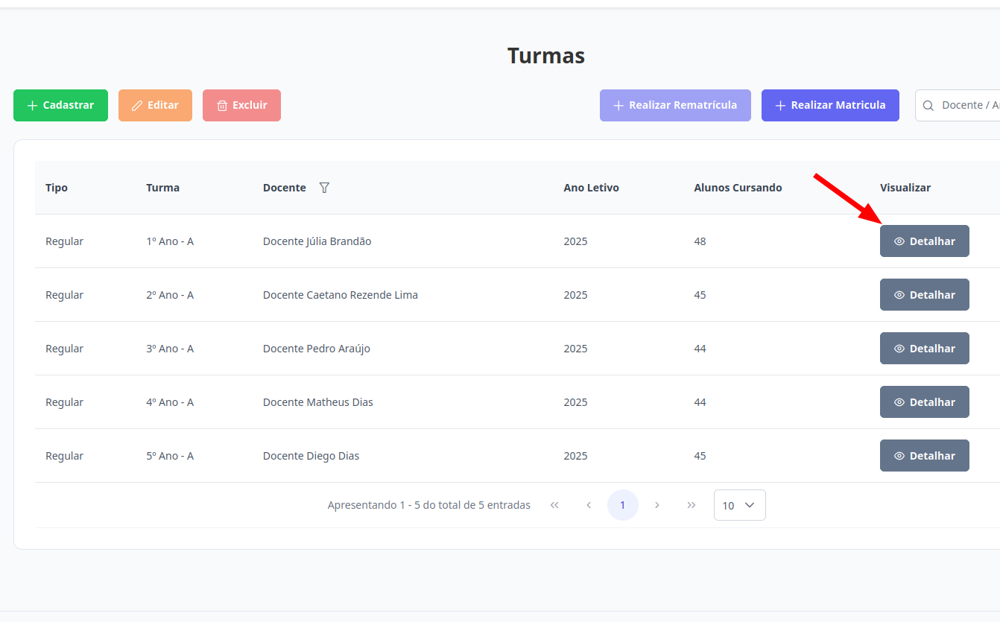
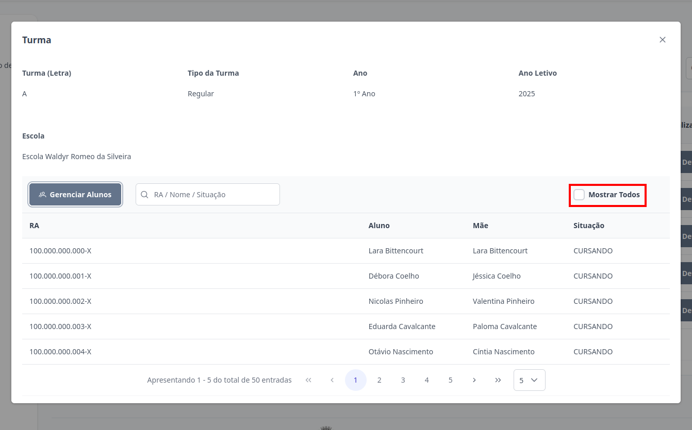
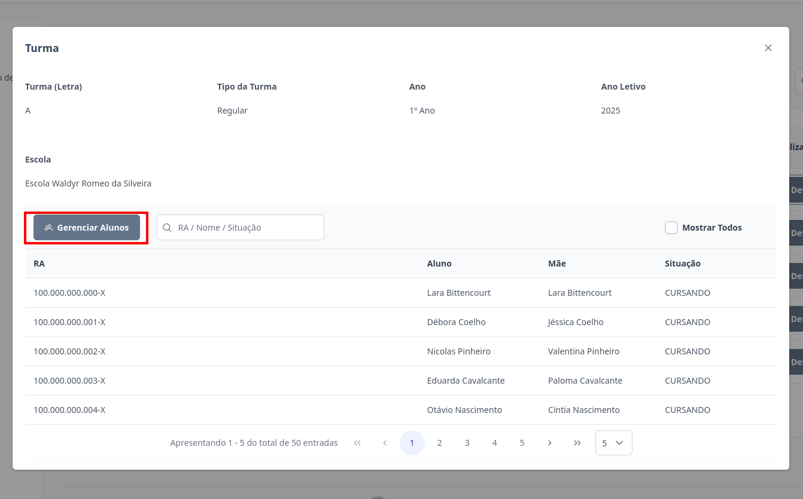

# Turmas
Esta seção permite realizar o detalhamento das turmas cadastradas no sistema. Os perfis de **Supervisor**, **Diretor** e **Escriturário** estão autorizados a executar essa ação.

## Detalhar Turma

> 1. Para visualizar detalhes da turma, clique no botão "Detalhar" destacado abaixo.     
> 
> É possível visualizar as informações da turma. Para exibir todos os alunos, inclusive aqueles que já não fazem mais parte dela, clique na opção "Mostrar todos".
> 

> 2. Para visualizar os alunos de forma mais organizada, clique no botão "Gerenciar Alunos". Você será direcionado para a página [Visualizar Alunos](../alunos/visualizar-alunos.md) daquela turma selecionada.
> 