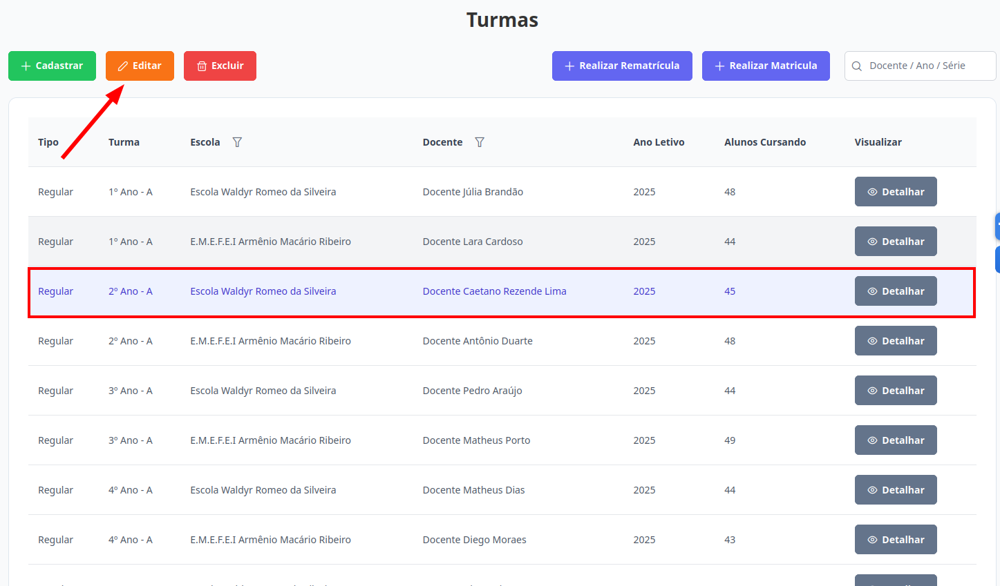
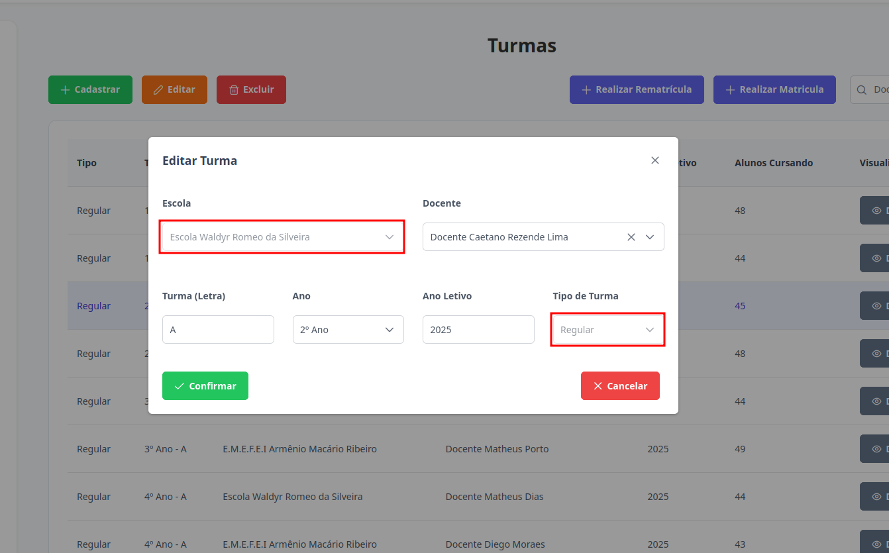

# Turmas
Esta seção permite a edição de turmas. Os níveis de **Supervisor**, **Diretor** e **Escriturário** estão autorizados para executar esta ação.

## Editar Turma

> 1. Para editar, selecione a turma desejada e clique no botão "Editar".
> 
    
> 2. Atualize os campos desejados. O campo Escola e Tipo de Turma não podem ser modificados.
> 

> 3. Para finalizar a edição clique no botão "Confirmar". Caso não queira prosseguir com o cadastro, clique em "Cancelar".
> 

Pronto, a turma foi editada.
