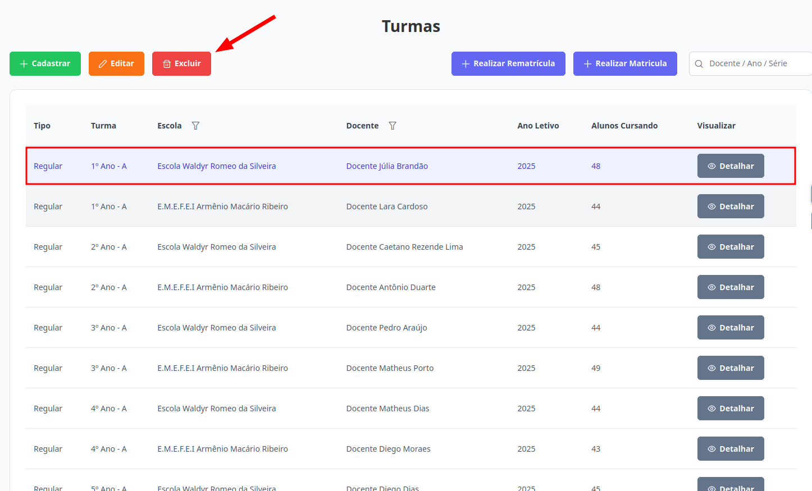

# Turmas
Esta seção permite a exclusão de uma turma somente se não houver nenhum aluno vinculado a ela. Os níveis de **Supervisor**, **Diretor** e  **Escriturário** estão autorizados para executar esta ação.

## Excluir Turma

> 1. Para excluir, selecione a turma desejada e clique no botão "Excluir".
> 
    
> 2. Para concluir a ação clique no botão "Confirmar". Caso Contrário, clique em "Cancelar".
> 

Pronto, a turma foi excluída.
