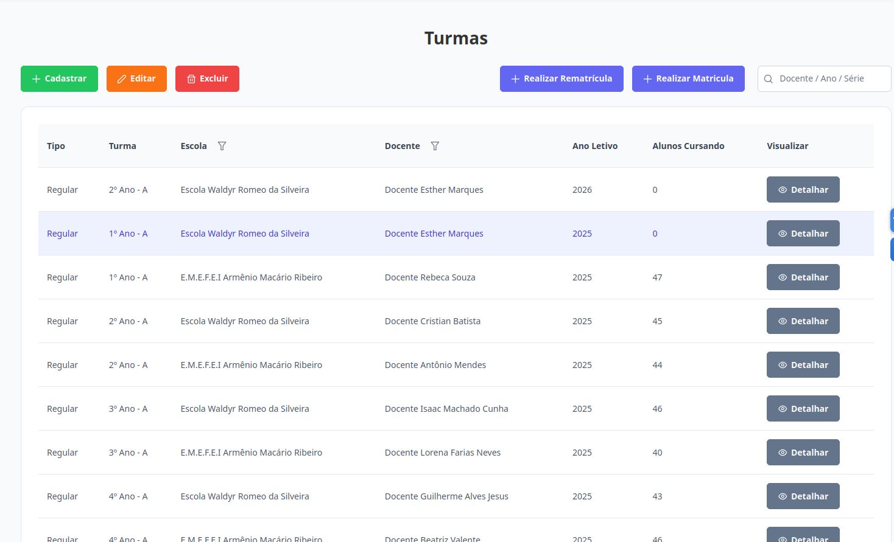

# Turmas
Esta seção permite a visualização das turmas. O acesso é permitido para os níveis de **Supervisor**, **Diretor** e **Escriturário**.

## Visualizar Turmas

Na aba de "Turmas", esta é a visualização de todos as turmas para o **Supervisor**: 

Na aba de "Turmas", esta é a visualização de todos os alunos para o **Diretor** e **Escriturário**: 

O **Supervisor** pode filtrar turmas de uma escola específica.

Para localizar uma turma específica, utilize os filtros de Escola e/ou Docente.

## Ações disponíveis:

[Cadastrar Turma](./cadastrar-turma.md): permite incluir uma nova turma no sistema.

[Editar Turma](./editar-turma.md): possibilita a atualização de uma turma existente.

[Excluir Turma](./excluir-turma.md): remove uma turma do sistema de forma definitiva.
<!-- [Cadastrar Aluno](./cadastrar-aluno.md): permite incluir um novo aluno no sistema.

[Editar Aluno](./editar-aluno.md): possibilita a atualização de um aluno existente.

[Excluir Aluno](./excluir-aluno.md): remove um aluno do sistema de forma definitiva.

[Realizar Matrícula](./realizar-matricula.md): permite matricular um aluno em uma turma.

[Visualizar Respostas de Formulários](./visualizar-formularios.md): exibe os formulários respondidos para determinado aluno.

[Visualizar ou Anexar Documentos](./documentos.md): possibilita a visualização e o anexo de documentos para um aluno. -->