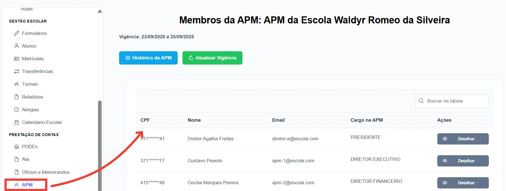

Esta seção do manual aborda o módulo de gerenciamento da Associação de Pais e Mestres (APM) dentro do sistema de <strong>Prestação de Contas</strong>, cujo objetivo principal é apoiar a organização, transparência e controle das atividades administrativas da APM nas unidades escolares municipais. A APM tem papel fundamental na colaboração entre a escola e a comunidade, participando da gestão democrática e do acompanhamento das ações que impactam o ambiente escolar.

  
No sistema, usuários com perfil de <strong>Diretor</strong> possuem acesso total à administração da APM, podendo cadastrar novos membros, modificar cargos, criar e desativar integrantes, visualizar e armazenar atas de reuniões.

  
Por outro lado, usuários com perfil de <strong>Membro da APM</strong> possuem acesso restrito, limitado ao acompanhamento dos processos, visualização de documentos anexados, consulta do status da prestação de contas e do histórico das atividades da associação, sem permissão para realizar operações administrativas.

Dessa forma, o sistema garante que a gestão e atualização dos dados da APM fiquem sob responsabilidade da direção escolar, enquanto os membros exercem papel de fiscalização, transparência e apoio às decisões tomadas, fortalecendo a participação democrática na escola.

<figure style="margin: 0.5em 0;">
    
    <figcaption style="margin-top: 0.3em; text-align: center;">Figura 1: Tela APM
    </figcaption>

</figure>
