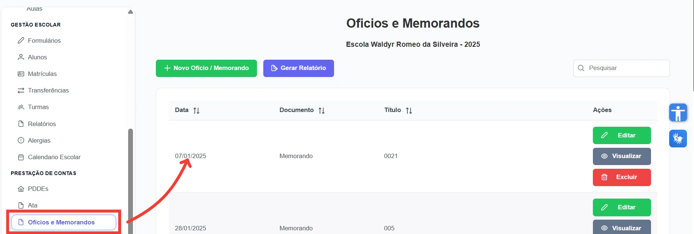
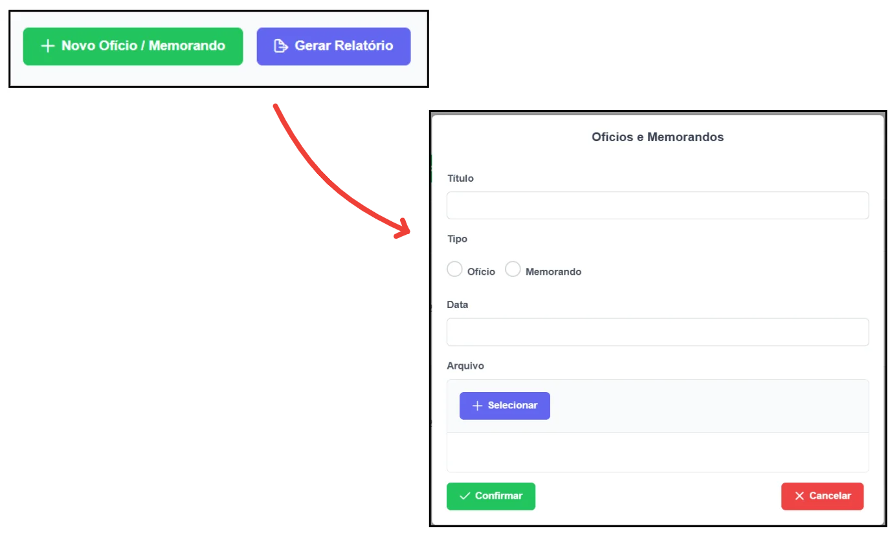

Ofícios e Memorandos desempenham papel central na formalização das comunicações e solicitações da escola, garantindo transparência e organização administrativa.

  

Na tela <strong>"Ofícios e Memorandos"</strong>, é possível acessá-los, bem como criar, editar, visualizar, excluir e exportá-los.

<figure style="margin: 0.5em 0;">
    
    <figcaption style="margin-top: 0.3em; text-align: center;">Figura 1: Tela Ofícios e Memorandos.</figcaption>
</figure>

**Criar Ofício ou Memorando**

Para criar um Ofício ou Memorando, clique em <strong>"Novo Ofício/Memorando"</strong> e preencha os seguintes campos:

<ul align="justify">
   <li><strong>Título:</strong> descrição do documento;</li>
   <li><strong>Tipo:</strong> selecione se é um Ofício ou Memorando;</li>
   <li><strong>Data:</strong> data do documento;</li>
   <li><strong>Arquivo:</strong> insira o arquivo correspondente.</li>
</ul>

<figure style="margin: 0.5em 0;">
    
    <figcaption style="margin-top: 0.3em; text-align: center;">Figura 2: Inserir Ofício ou Memorando.</figcaption>
</figure>

Após preencher todos os campos, clique em <strong>"Salvar"</strong> para concluir o registro do documento no sistema.

**Exportar Ofícios e Memorandos**

Para exportar os Ofícios e Memorandos, selecione o ano desejado no campo <strong>"Ano"</strong> e clique em <strong>"Gerar Relatório"</strong>. Assim, todas os documentos referentes ao período escolhido serão exportados.

