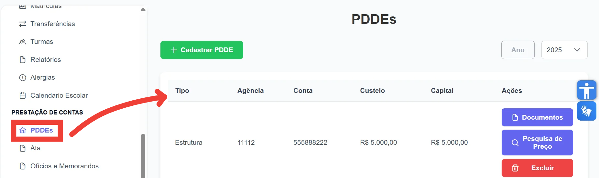

Esta seção do manual aborda o módulo de gerenciamento do PDDE dentro do sistema de <strong>Prestação de Contas</strong>, que tem como objetivo principal garantir o controle transparente e eficiente dos recursos financeiros destinados diretamente às escolas municipais. O PDDE é um programa governamental que repassa verbas diretamente para as unidades escolares, facilitando a execução de projetos e melhorias locais. O cadastro correto e o acompanhamento rigoroso das contas associadas ao PDDE são fundamentais para assegurar a correta aplicação dos recursos, a prestação de contas adequada e a conformidade com as exigências legais e administrativas.
  
No sistema, usuários com perfil de <strong>Diretor</strong> poderão realizar o cadastro de novos PDDEs e associá-los a contas bancárias específicas, além de gerenciar os programas relacionados, registrar receitas e despesas, anexar documentos e realizar a prestação de contas detalhada. O manual detalha os procedimentos necessários para estas operações, visando orientar o usuário a desempenhar essas funções de forma ágil e segura.

  
<strong>Nessa seção será possível:</strong>

<ul>
  <li>Criar um PDDE vinculando-o a uma conta bancária;</li>
  <li>Gerar e armazenar documentos relativos à prestação de contas;</li>
  <li>Criar programas vinculados a pesquisas de preço e aquisições,
  entre outras funcionalidades essenciais para o acompanhamento completo do programa PDDE.  
</li>
</ul>  
 
<figure>
  
  <figcaption>Figura 1: Tela Inicial PDDE</figcaption>
</figure>

