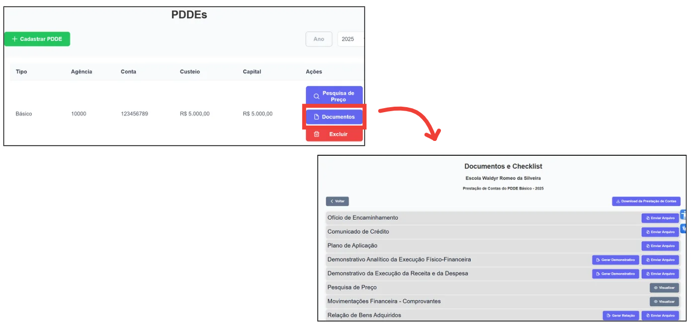

 O armazenamento de documentos no sistema garante a preservação, a segurança e a organização dos registros da APM, facilitando consultas, auditorias e a prestação de contas conforme as exigências legais. O sistema permite que os documentos sejam armazenados digitalmente, assegurando fácil acesso e organização.

  
Para acessá-los, após ter cadastrado um PDDE, clique em <strong>"Documentos"</strong>. Caso ainda não tenha criado um PDDE, clique <a href="/prestacao-contas/PDDE/criarPDDE/">aqui</a> para mais informações.

<figure style="margin: 0.5em 0;">
    
    <figcaption style="margin-top: 0.3em; text-align: center;">Figura 1: Acessar Documentos PDDE</figcaption>
</figure>

<strong>Documento Gerados: </strong>
    <ul>
        <li><strong>Demonstrativo Analítico da Execução Físico-Financeira</strong></li>
        <li><strong>Demonstrativo da Execução da Receita e da Despesa</strong></li>
        <li><strong>Relação de Bens Adquiridos</strong></li>
        <li><strong>Termo de Doação</strong></li>
        <li><strong>Conciliação Bancária</strong></li>
        <li><strong>Atas da APM</strong></li>
        <li><strong>Ofícios e Memorandos</strong></li>
        <li><strong>Parecer do Conselho Fiscal</strong></li>
        <li><strong>Planilha de Pesquisa de Preço</strong></li>
        <li><strong>Consolidação de Pesquisa de Preço</strong></li>
    </ul>

<strong>Documento Importáveis: </strong>
    <ul>
        <li><strong>Ofício de Encaminhamento</strong></li>
        <li><strong>Comunicado de Crédito</strong></li>
        <li><strong>Plano de Aplicação</strong></li>
        <li><strong>Movimentações Financeira - Comprovantes</strong></li>
        <li><strong>Protocolo de Tombamento</strong></li>
        <li><strong>Atas da APM</strong></li>
        <li><strong>Ofícios e Memorandos</strong></li>
    </ul>

