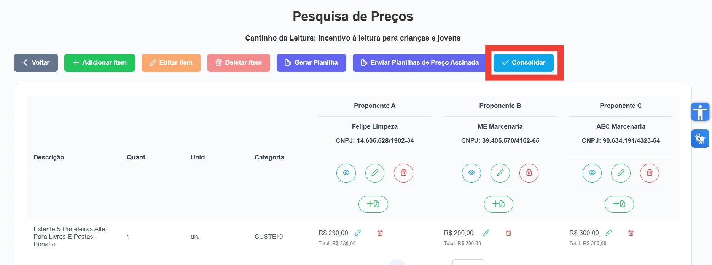
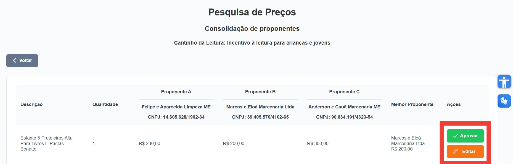
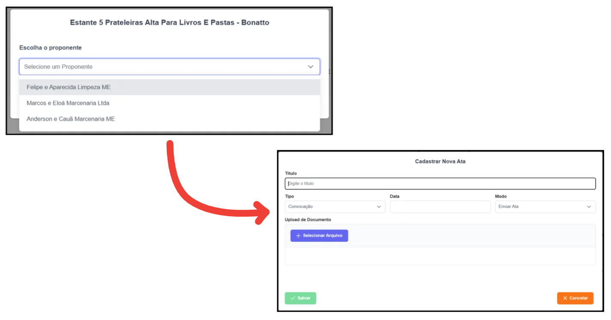

 
Após a realização da pesquisa de preços, é possível consolidá-la. Consolidar uma pesquisa de preços significa selecionar as melhores propostas de cada proponente para cada item, gerar os documentos correspondentes e adicionar as notas fiscais. 
  
Caso a pesquisa de preços já tenha sido realizada, clique no botão <strong>"Consolidar"</strong>. Se ainda não foi realizada, acesse a sessão <strong>Realizar Pesquisa de Preço</strong> clicando <a href="/prestacao-contas/PDDE/pesquisa-preco/realizarPesquisa/">aqui</a>.

<figure style="margin: 0.5em 0;">
    
    <figcaption style="margin-top: 0.3em; text-align: center;">Figura 1: Botão Consolidar Pesquisa de Preço
    </figcaption>
</figure>

 
Após clicar no botão <strong>"Consolidar"</strong>, será exibida uma tela mostrando todos os itens e o proponente com o menor valor associado a cada um. Em seguida, você poderá optar por aprovar ou não os itens. 

<figure style="margin: 0.5em 0;">
    
    <figcaption style="margin-top: 0.3em; text-align: center;">Figura 2: Botões de Ações
    </figcaption>
</figure>

 Caso deseje selecionar um proponente diferente do que apresentou o menor valor, clique em <strong>"Editar"</strong>, escolha o proponente desejado e insira uma ata justificando o motivo. 

  
Para mais informações sobre <strong>Atas</strong>, clique <a href="">aqui</a>.

<figure style="margin: 0.5em 0;">
    
    <figcaption style="margin-top: 0.3em; text-align: center;">Figura 3: Alterar melhor Proponente
    </figcaption>
</figure>

