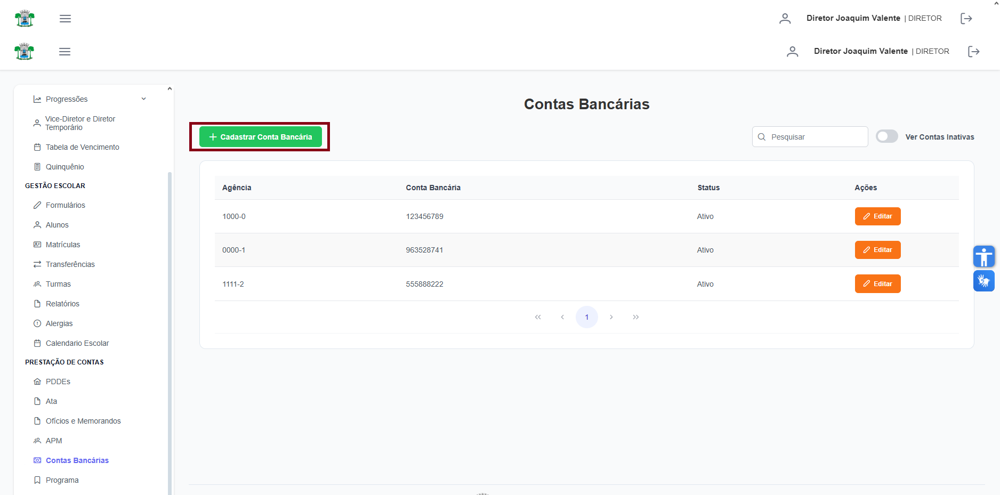
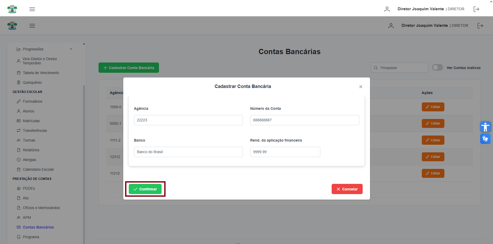

# Contas Bancárias

**Localização:** Menu principal → **Prestação de Contas** → **Contas Bancárias**  

## Visão geral
Gerencie as contas bancárias da escola: cadastrar nova conta, editar dados da conta, consultar status e visualizar a lista.

## Ações principais
- **Cadastrar Conta Bancária** — abre formulário de cadastro.
- Campo de pesquisa (à direita) — filtra a lista por agência/conta/banco.

---
## 1) Como cadastrar uma nova conta bancária
1. Clique em **Cadastrar Conta Bancária** (barra superior).  
   
2. Preencha os campos do formulário:
   - **Agência** — número da agência (somente números).
   - **Número da Conta** — número da conta (campo `Conta Bancária` no cabeçalho da tabela).
   - **Banco** — nome do banco (pode estar preenchido por padrão; se for select, escolha o banco).
   - **Rend. da aplicação financeira** — rendimento esperado (campo numérico, usar `.` como separador decimal).
   
3. Clique em **Confirmar** para salvar a conta.

---
## 2) Como editar uma conta existente
1. Localize a conta na tabela (use o campo de pesquisa se precisar).
2. Clique em **Editar** na coluna **Ações** da linha correspondente.
3. Atualize os campos e clique em **Confirmar**. O sistema atualizará a listagem.

