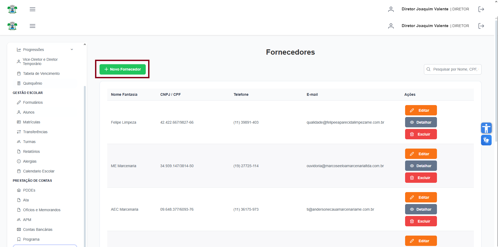

# Fornecedores

**Localização:** Menu principal → **Prestação de Contas** → **Fornecedores**  

## Visão geral
Tela para cadastrar e gerenciar fornecedores: dados cadastrais, contato, endereço, documentos (CNPJ/CPF), telefone e e‑mail.

## Ações principais
- **Novo Fornecedor** — abre formulário de cadastro/edição.
- Pesquisa (`pesquisar por nome, cpf, cnpj, e-mail...`) — filtra a lista.
- Ações de linha: **Detalhar**, **Editar**, **Excluir**.

---
## 1) Como cadastrar um novo fornecedor
1. Clique em **Novo Fornecedor** (barra superior).  
   
2. Preencha os campos do formulário (principais):
   - **CNPJ / CPF** — digite o CNPJ ou CPF (sem `.` ou `/` apenas números).
   - **Razão Social** — nome completo legal da empresa.
   - **Nome Fantasia** — nome comercial.
   - **Endereço / Cidade** — preencha endereço e cidade do fornecedor.
   - **Responsável** — nome da pessoa de contato.
   - **Telefone** — telefone de contato.
   - **Email** — e‑mail para contato.
   - **Status do Fornecedor** — ativo / inativo.
   
3. Clique em **Confirmar** para salvar o fornecedor no sistema.

---
## 2) Como editar, detalhar e excluir
- **Detalhar**: abre a visão somente leitura com botão **Cancelar** para fechar.
- **Editar**: abre o formulário em modo edição; altere o que for necessário e clique em **Confirmar**.
- **Excluir**: clique em **Excluir** na linha e confirme em **Confirmar** no diálogo de exclusão.

