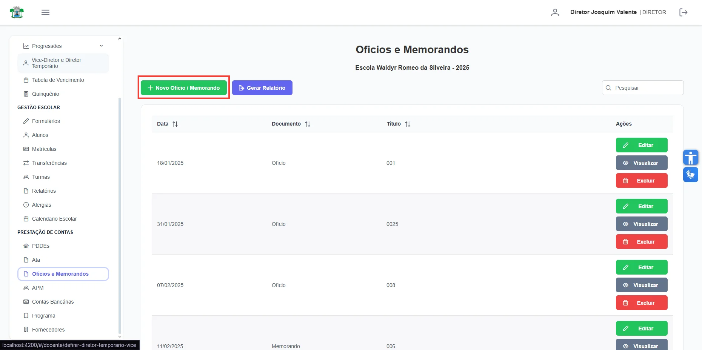
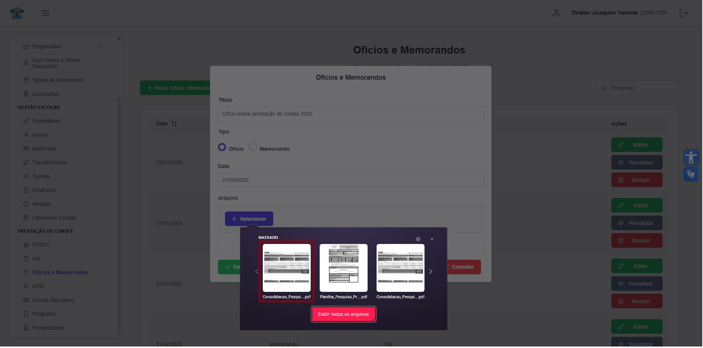
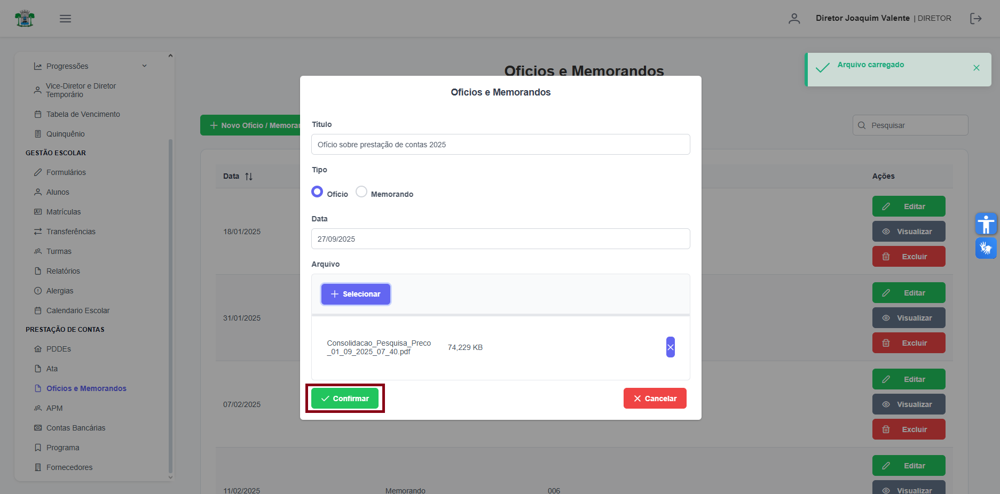
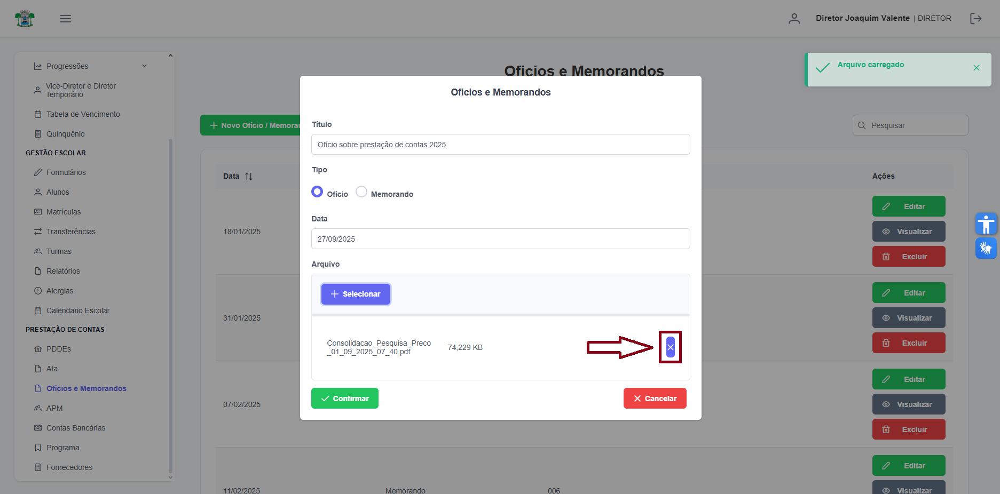
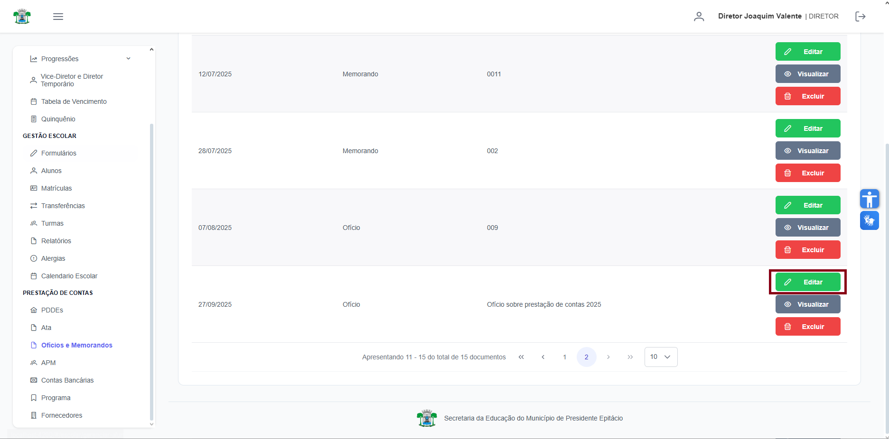
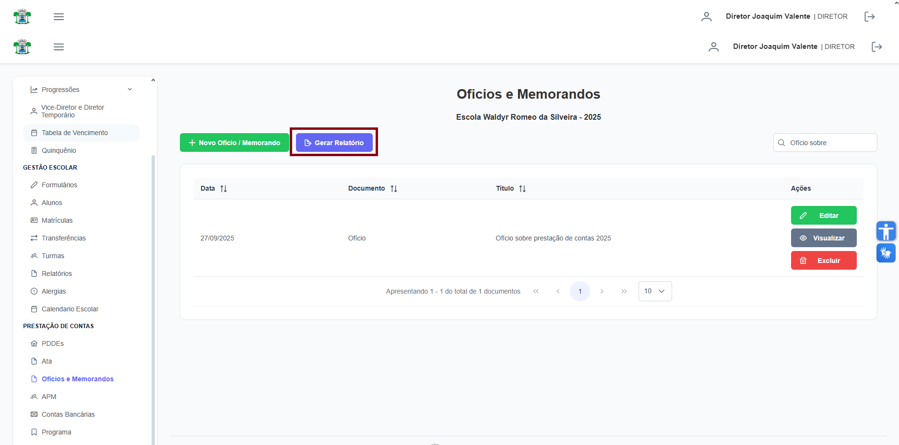

# Ofícios e Memorandos

**Localização:** Menu principal → **Prestação de Contas** → **Ofícios e Memorandos**  

## Visão geral
Nesta tela você gerencia os ofícios e memorandos da escola: cadastrar, editar, visualizar, excluir e gerar relatórios.

## Ações principais (barra superior)
- **Novo Ofício / Memorando** — abre a janela de cadastro.
- **Gerar Relatório** — gera um relatório da listagem atual.
- Campo de pesquisa (à direita) — pesquisa/filtra os registros exibidos.

---
## 1) Como cadastrar um novo Ofício / Memorando
1. No menu lateral clique em **Prestação de Contas** → **Ofícios e Memorandos**.
2. Clique no botão **Novo Ofício / Memorando** (barra superior).  
   
3. Na janela **Ofícios e Memorandos** preencha os campos:
   - **Título** — digite o título do documento (ex.: `Ofício sobre prestação de contas 2025`).
   - **Tipo** — selecione **Ofício** ou **Memorando** (opções de radio).
   - **Data** — escolha a data (clique no campo para abrir o calendário).
   - **Arquivo** — clique em **Selecionar** (botão do upload) e escolha o arquivo (.pdf, .docx, etc.). Ao subir o arquivo aparecerá o link **Visualizar arquivo salvo**.
   
4. Clique em **Confirmar** para salvar. A janela será fechada e o registro aparecerá na tabela.
    

> Dica: se precisar remover o arquivo anexado antes de salvar, use **Remover arquivo** dentro da janela.

---
## 2) Como editar um registro
1. Localize o registro na tabela (use a pesquisa se necessário).
2. Clique em **Editar** na coluna de **Ações** da linha desejada.

3. A janela abrirá em modo de edição — altere os campos desejados e clique em **Confirmar**.

---
## 3) Como visualizar um arquivo
1. Na lista, clique em **Visualizar** para abrir a visualização do documento anexado.
2. Para fechar, clique em **Cancelar** (ou no botão de fechar da janela ou clique fora da área da janela).

---
## 4) Como excluir um registro
1. Clique em **Excluir** (ícone/ação na coluna Ações) da linha correspondente.
2. Confirme a exclusão clicando em **Confirmar** no diálogo de confirmação.

---
## 5) Gerar Relatório
1. Clique em **Gerar Relatório** (barra superior) para exportar/baixar relatório dos Oficios e Memorandos.

