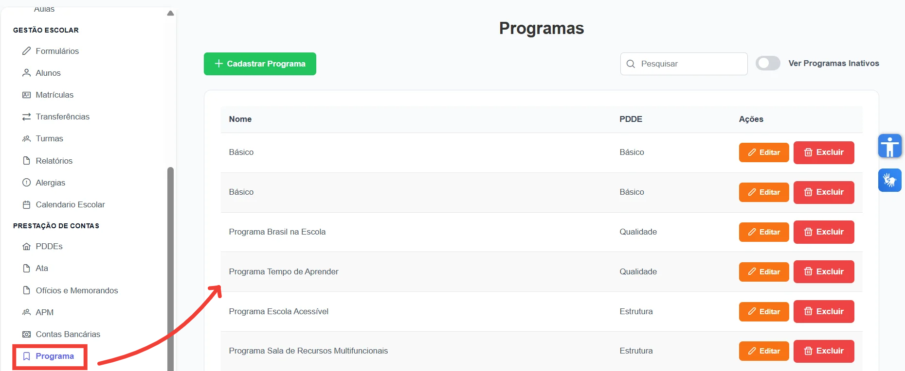
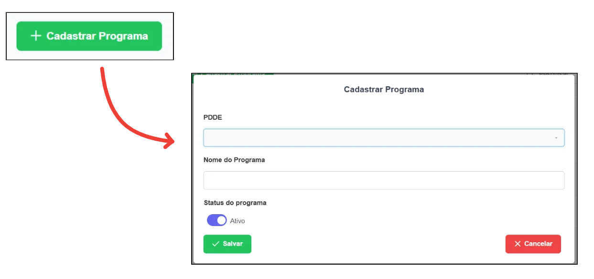

Os programas vinculados ao PDDE desempenham papel central na aplicação dos recursos, direcionando investimentos para áreas específicas da escola. Eles asseguram organização, transparência e melhor aproveitamento dos recursos financeiros.

Para acessá-los clique em **"Programas"** no menu principal. Nesta tela, é possível adicionar, editar, visualizar e excluir Programas.

*Figura 1: Tela Programas*

**Cadastrar Programa**

Para cadastrar um programa, clique em **"Cadastrar Programa"** e preencha os campos solicitados:

- **PDDE:** selecione o PDDE ao qual deseja vincular o novo programa.
- **Nome do Programa:** insira o título do programa.
- **Status do Programa:** indique se o programa está ativo ou inativo.

*Figura 2: Cadastrar Programa*

Por fim, após o cadastro, o programa poderá ser utilizado em uma pesquisa de preço vinculada a um PDDE.
