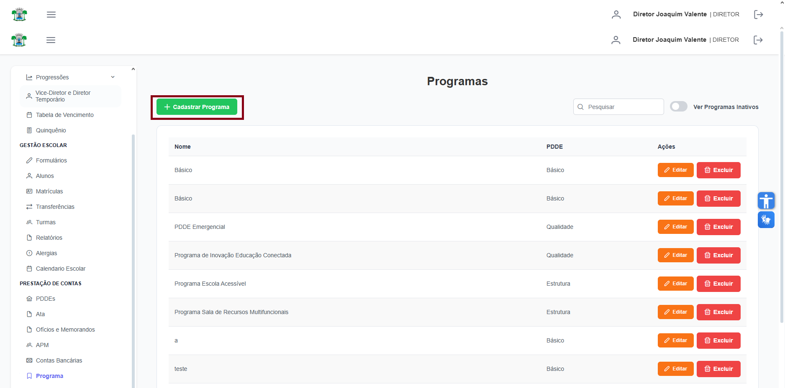
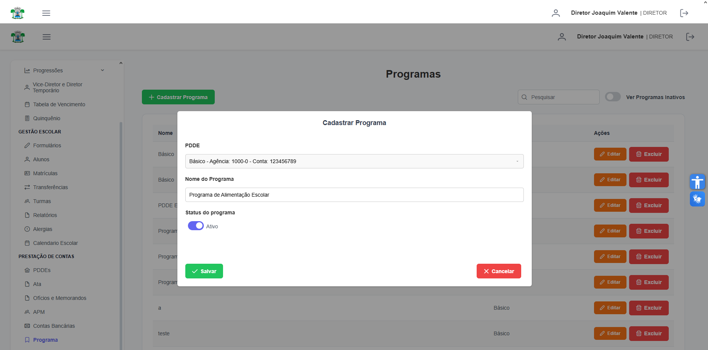

# Programa

**Localização:** Menu principal → **Prestação de Contas** → **Programa**  

## Visão geral
Nesta página você cadastra e gerencia os programas vinculados à prestação de contas (ex.: programas PDDE, etc.).

## Ações principais
- **Cadastrar Programa** — abre o formulário para criação.
- Botões de linha: **Editar**, **Excluir**, **Detalhar**.
- Campos principais: **PDDE**, **Nome do Programa**, **Status do Programa**.

---
## 1) Como cadastrar um novo Programa
1. Clique em **Cadastrar Programa** (barra superior).  
   
2. No formulário preencha:
   - **PDDE** — selecione o PDDE associado.
   - **Nome do Programa** — nome descritivo (ex.: `Programa de Alimentação Escolar`).
   - **Status do Programa** — ativo / inativo.
   
3. Clique em **Confirmar** (botão do diálogo) para salvar.

---
## 2) Como editar / excluir
- **Editar**: clique em **Editar** na linha desejada, altere os dados e clique em **Confirmar**.  
- **Excluir**: clique em **Excluir** e confirme a ação com **Confirmar** no diálogo de confirmação.

