# Configurações de ano Letivo

Esta seção é de uso exclusivo do **Supervisor** e destina-se ao gerenciamento completo dos parâmetros dos Anos Letivos.

## Gerenciar Configurações de Ano Letivo

Na aba de "Configurações de Ano Letivo":
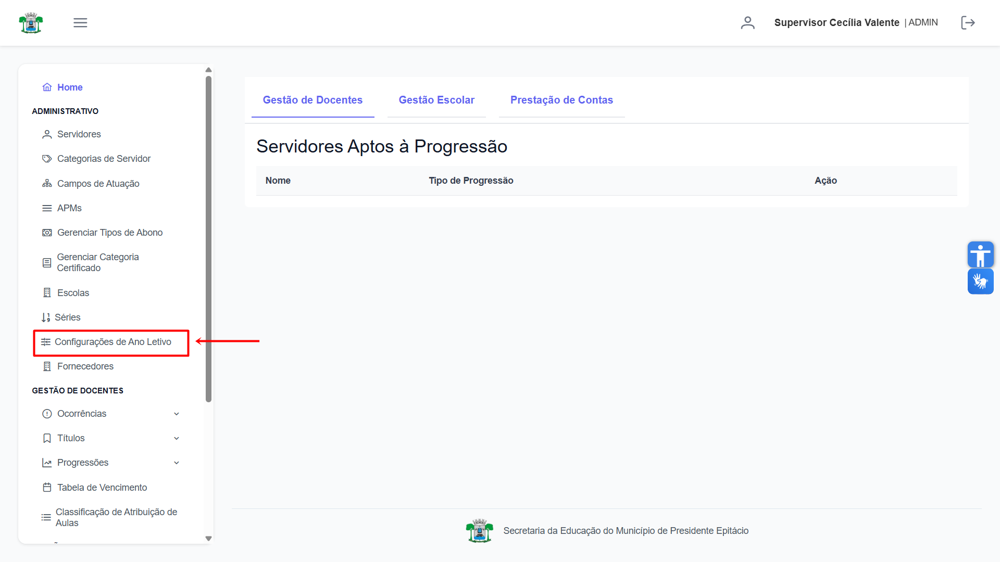

## Criar Configuração de Ano Letivo

Para iniciar o cadastro, clique no botão **"Criar Configuração"** localizado no canto superior esquerdo.
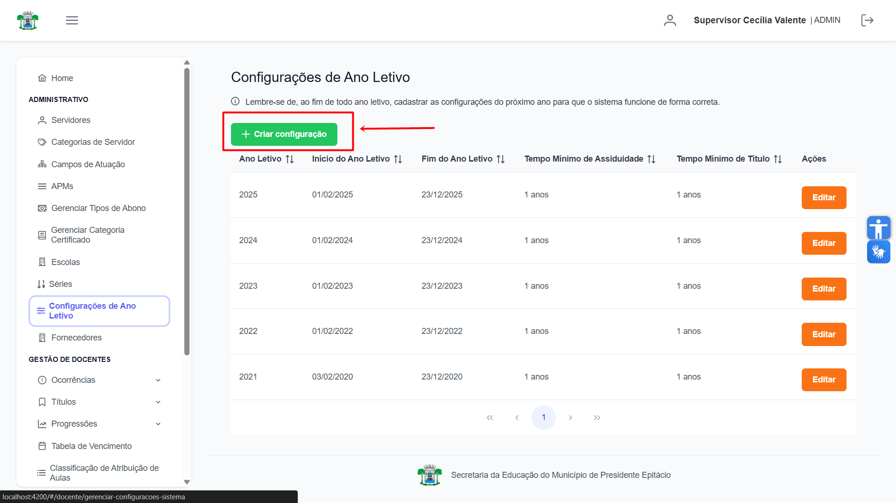

Clicando no botão, irá abrir uma tela para criar uma nova Configuração. Primeiro selecione o **Ano Letivo**.
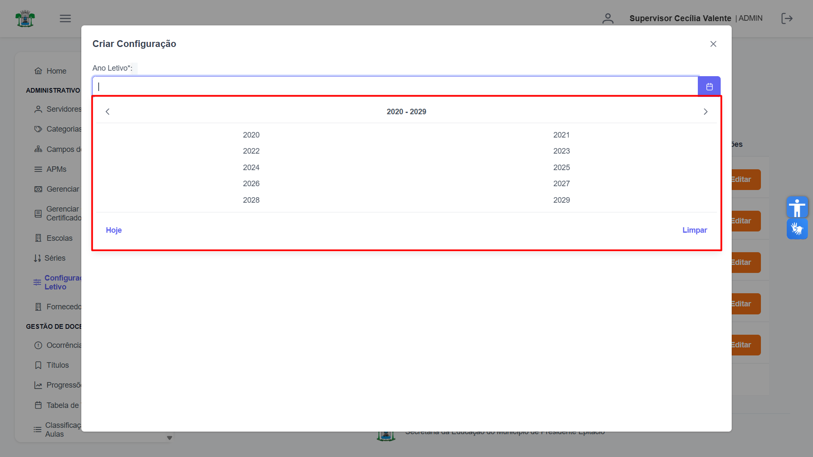

Defina a data de **Início do Ano Letivo**.
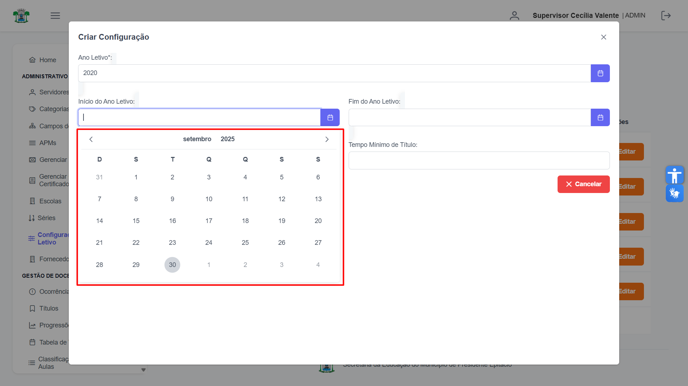

Defina a data de **Fim do Ano Letivo**.
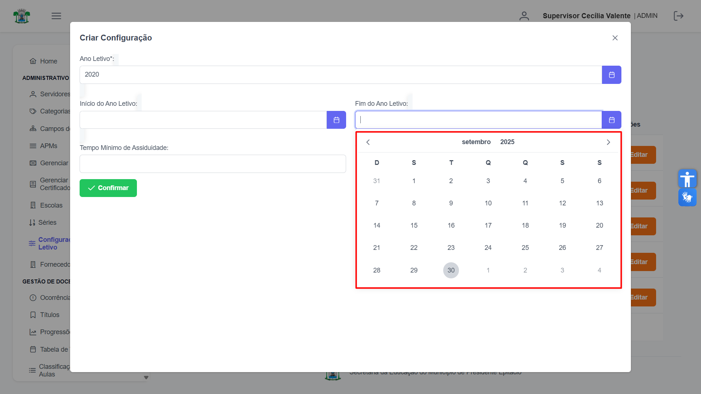

Informe o **Tempo Mínimo de Assiduidade** e o **Tempo Mínimo de Título**.
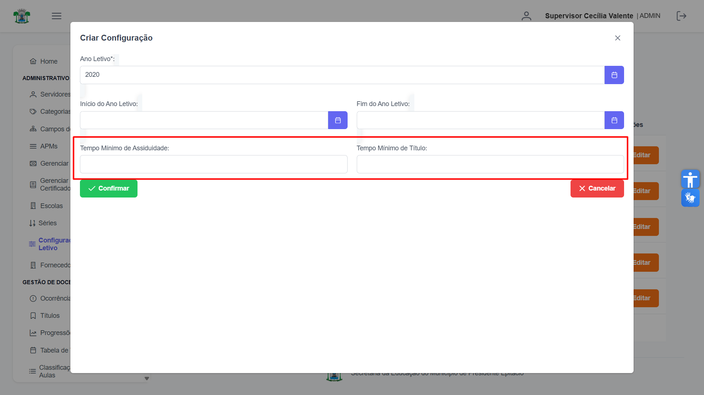

Para finalizar, clique em **"Confirmar"**.
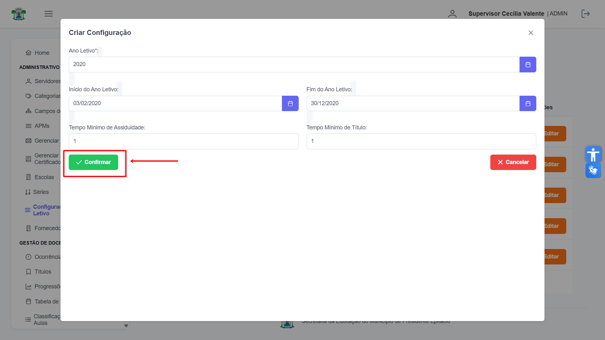

Uma mensagem de sucesso será exibida, e a nova configuração aparecerá na lista da tela principal.
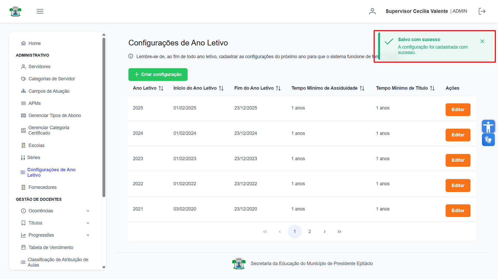

## Alterar Configuração de Ano Letivo

Na lista de configurações, localize o ano letivo que deseja modificar e clique no botão laranja **"Editar"** na coluna "Ações".
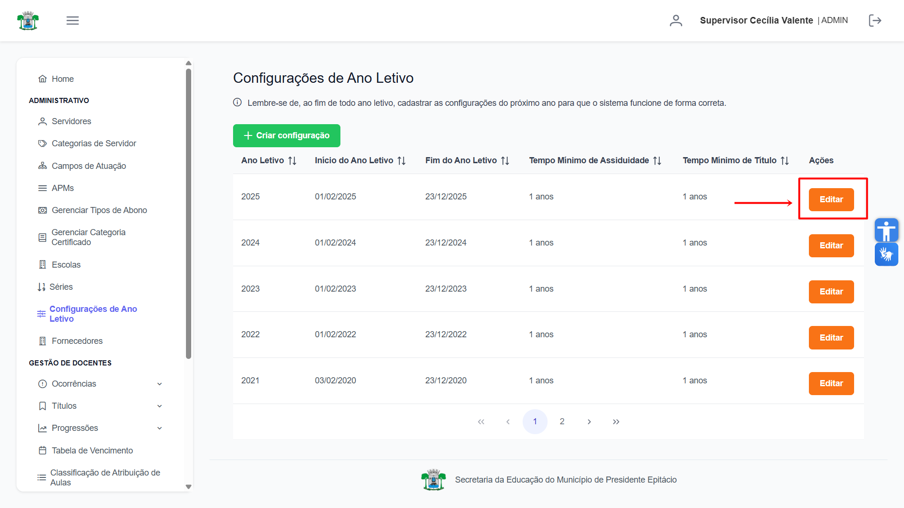

A tela de detalhes será exibida, permitindo a alteração dos campos. Se preferir descartar as alterações, utilize o botão **"Cancelar"**.
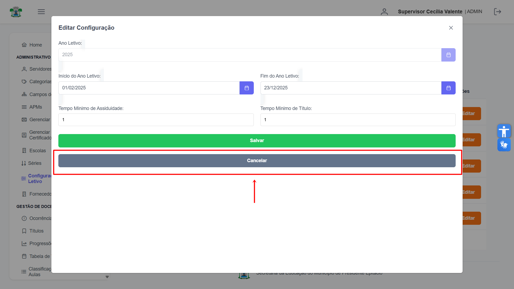

Para gravar as mudanças, clique em **"Salvar"**.
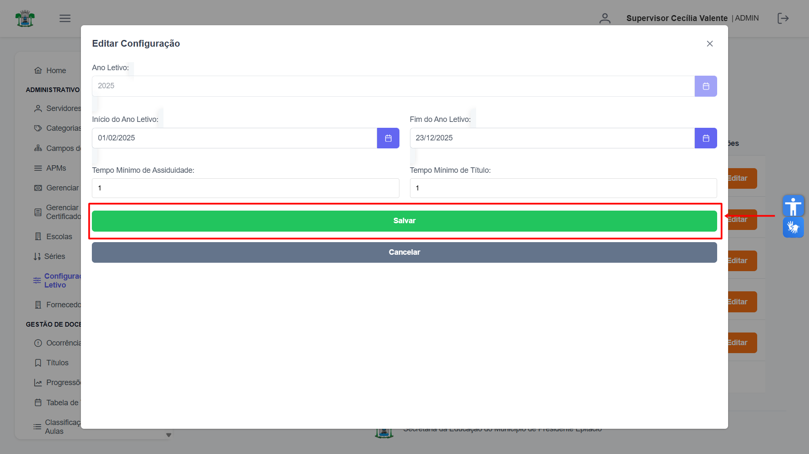

Após salvar, uma mensagem de sucesso confirmará a operação e os dados na lista serão atualizados.
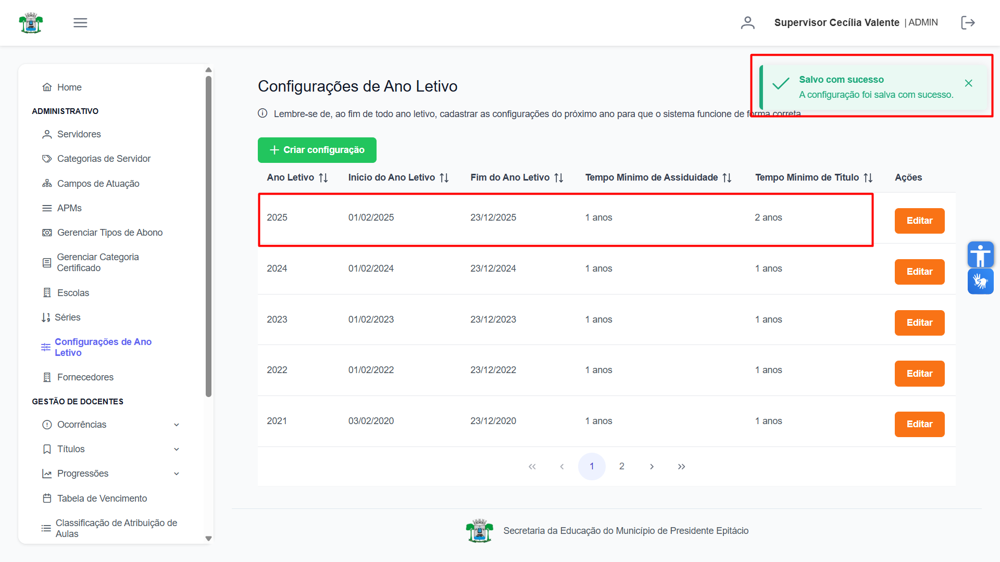