# Categorias de Certificado

Esta seção é de uso exclusivo do **Supervisor** e serve para gerenciar as **Categorias de Certificado**, que são utilizadas para classificar os títulos e formações dos docentes.

## Gerenciar Categorias de Certificado

Na aba de "Gerenciar Categorias Certificado":
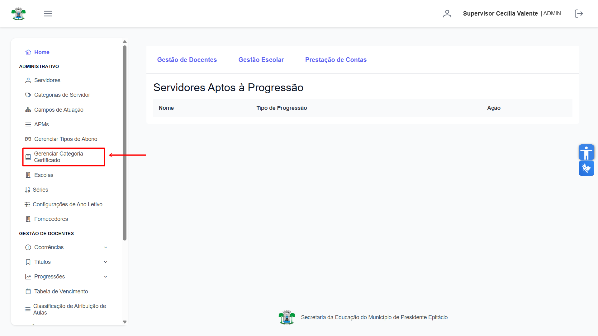

## Cadastrar Categoria de Certificado

Para adicionar uma nova categoria, clique no botão **"Cadastrar Categoria"** no canto superior esquerdo.
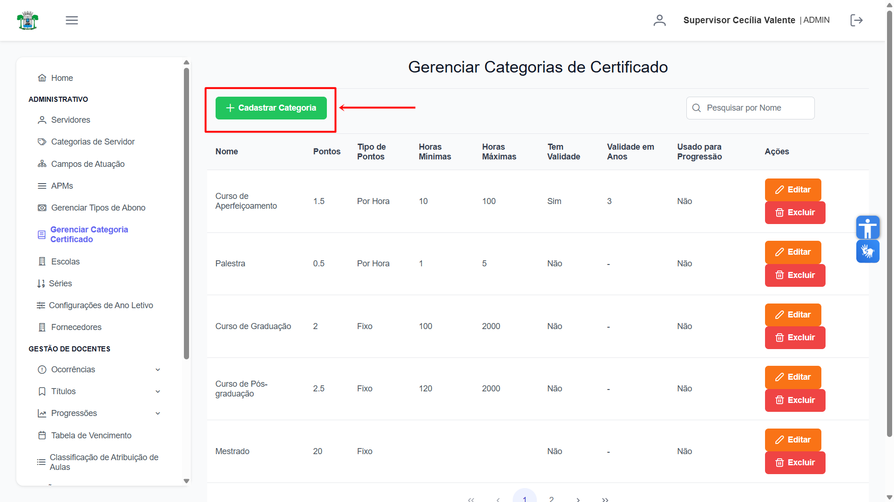

Na janela que se abre, preencha os campos com as informações da nova categoria e clique em **"Confirmar"**.
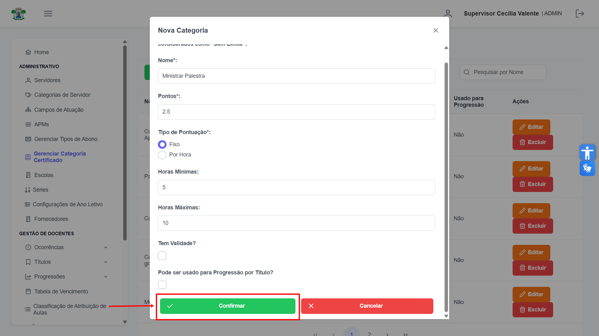

Após a confirmação, a nova categoria será adicionada à lista principal.
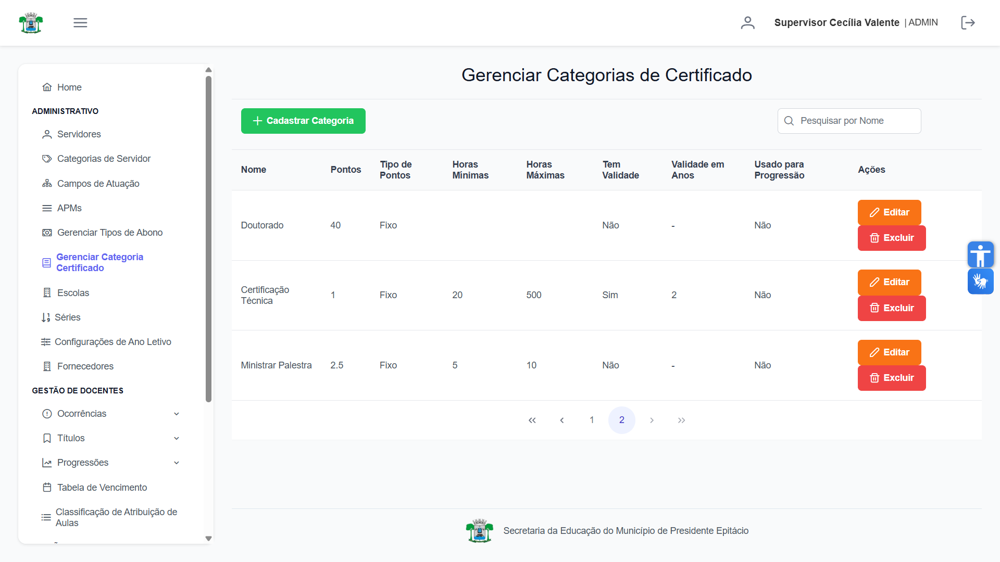

## Alterar Categoria de Certificado

Para modificar uma categoria existente, localize-a na lista e clique no botão laranja **"Editar"** na coluna "Ações".
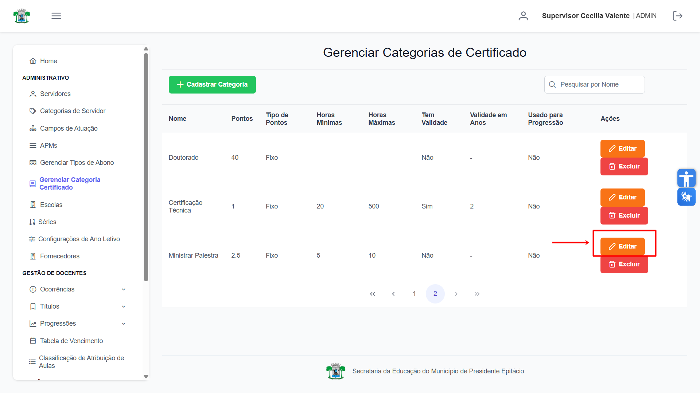

Na janela de edição, ajuste as informações conforme necessário. Você pode descartar as alterações clicando em **"Cancelar"**.
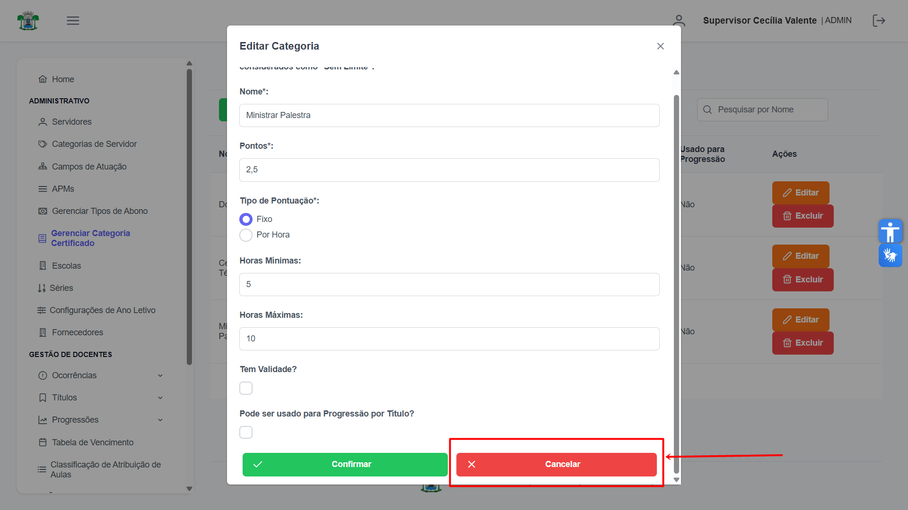

Para gravar as modificações, clique em **"Confirmar"**.
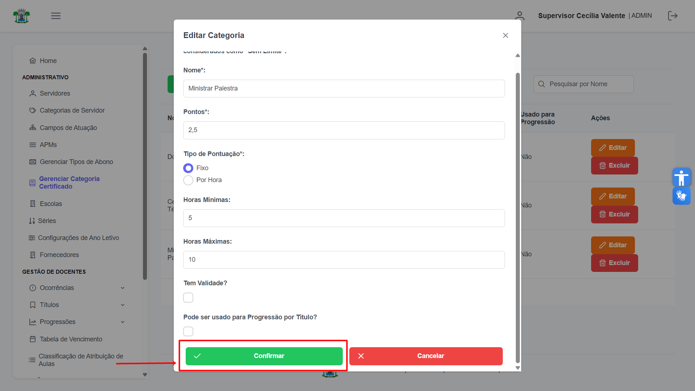

Após salvar, os dados da categoria serão atualizados na lista.
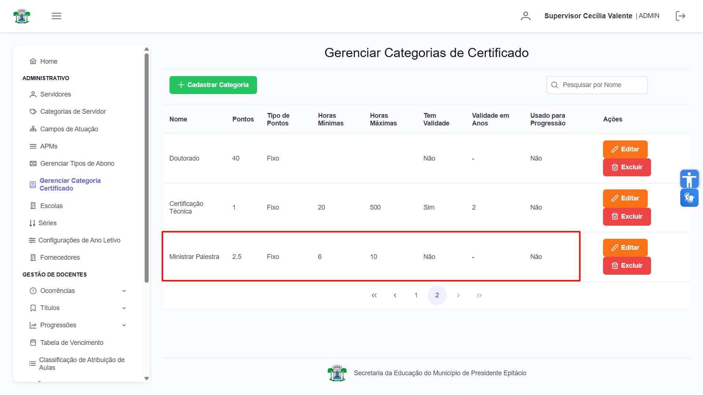

## Excluir Categoria de Certificado

Para remover uma categoria, localize-a na lista e clique no botão vermelho **"Excluir"** na coluna "Ações".
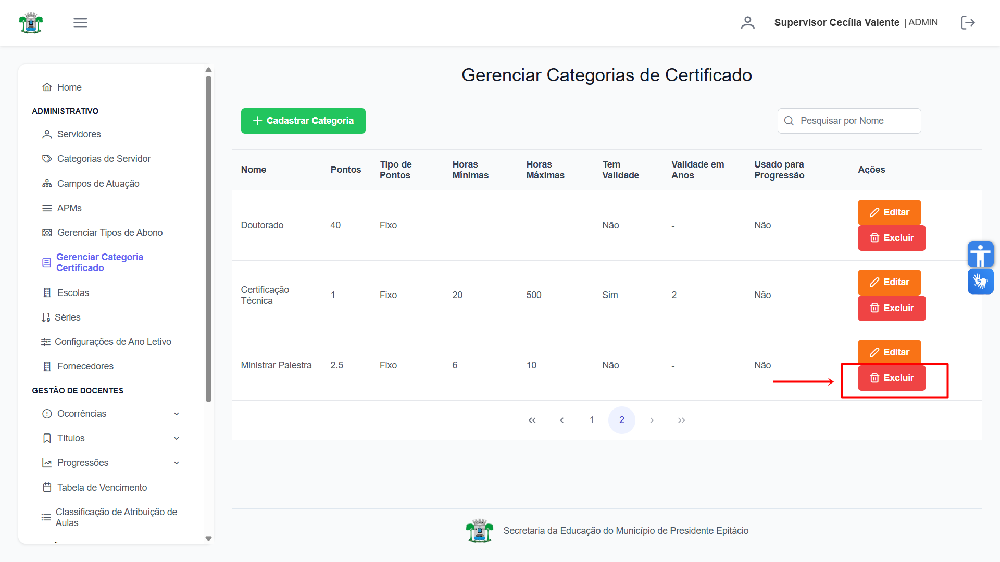

Uma janela de confirmação será exibida para garantir a segurança da operação.
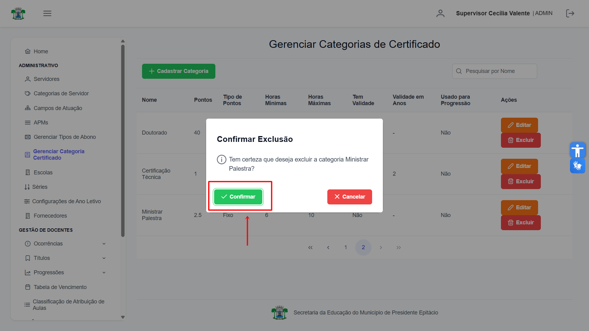

Ao clicar em **"Confirmar"**, a categoria será permanentemente removida do sistema, e uma mensagem de sucesso será mostrada.
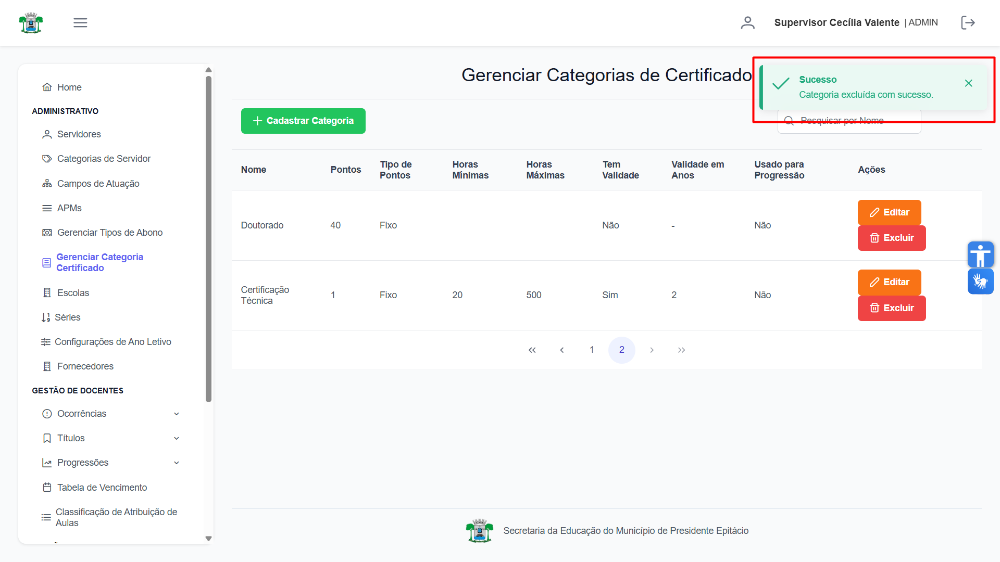