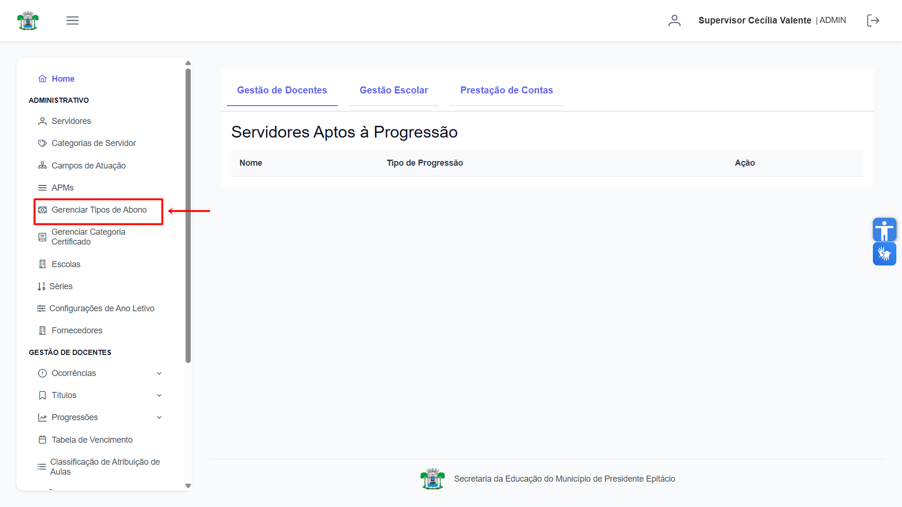
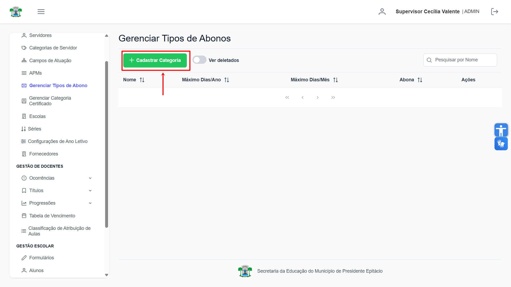
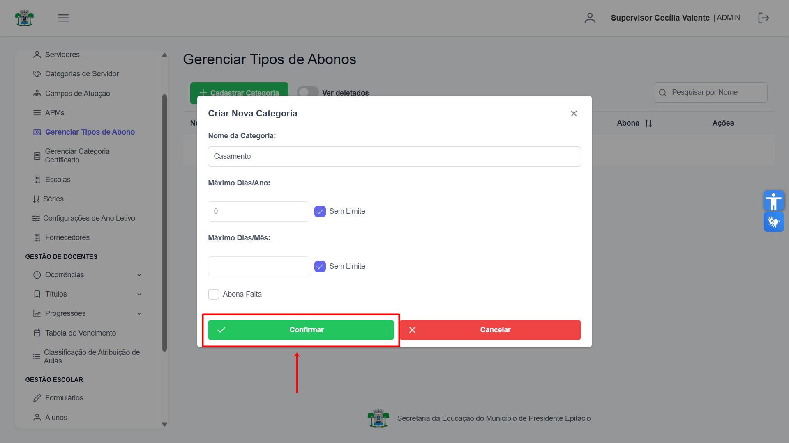
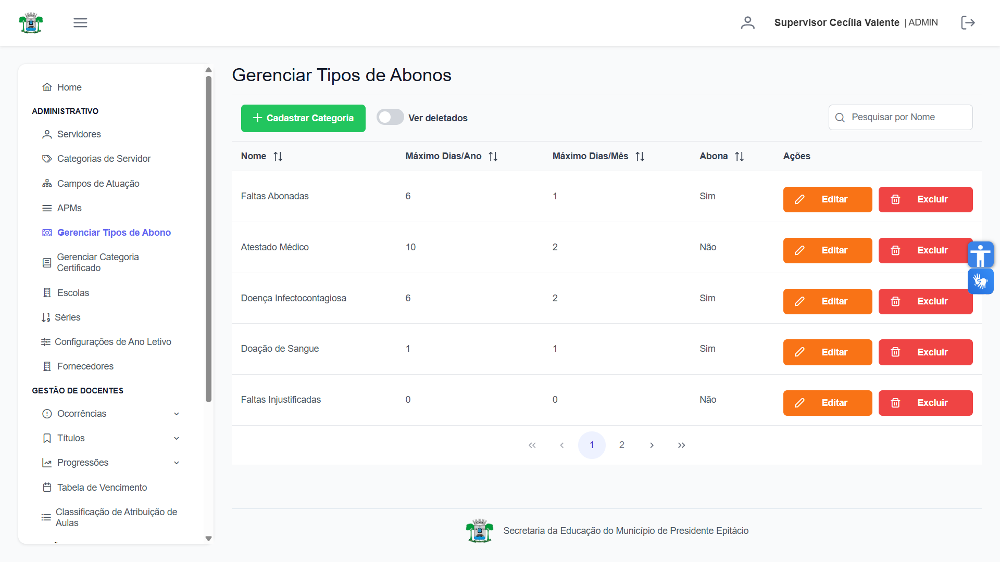
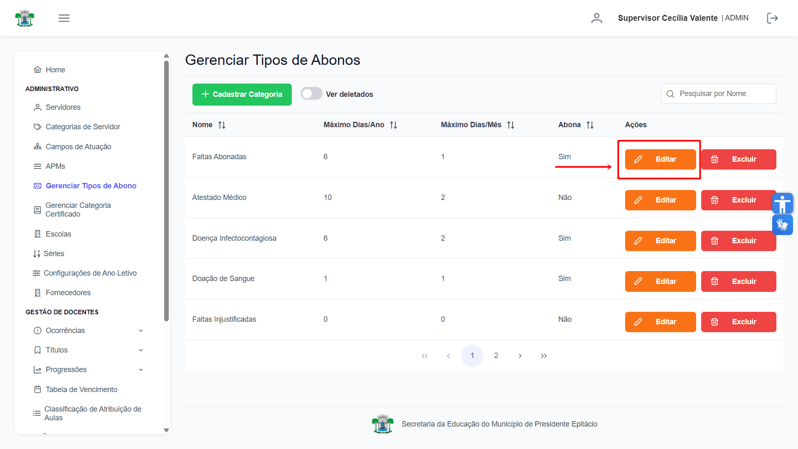
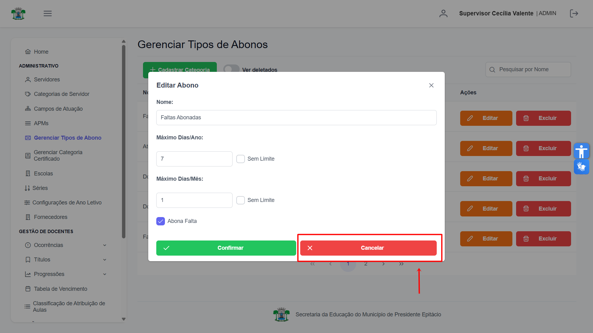
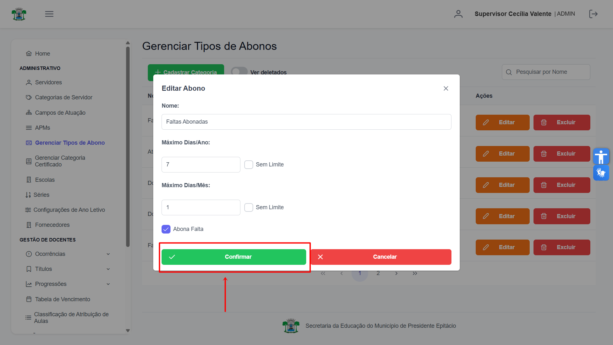
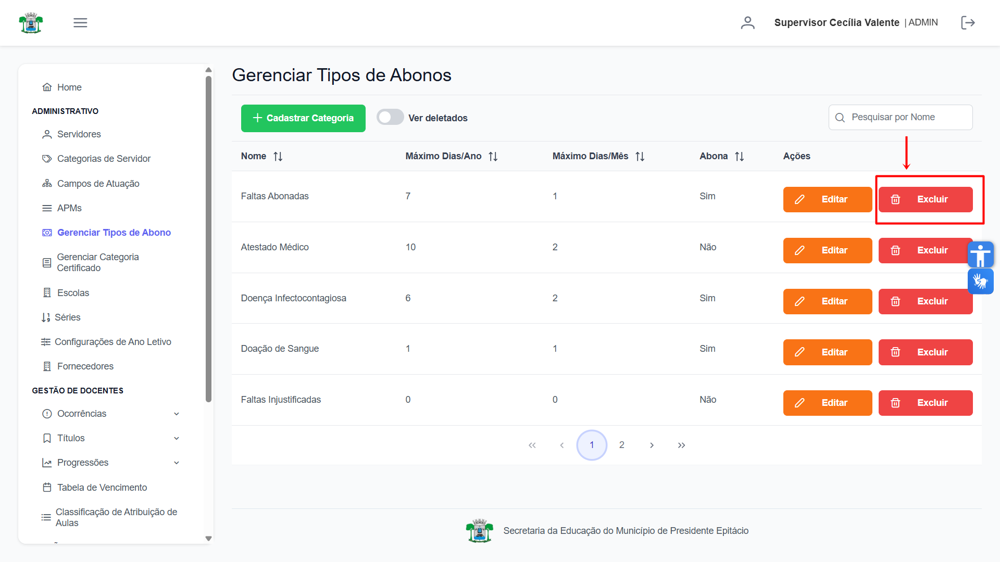
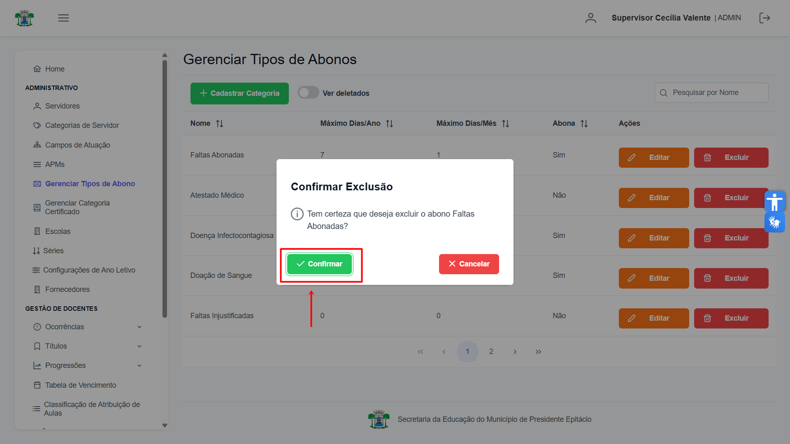

# Tipos de Abono

Esta seção é de uso exclusivo do **Supervisor** e é utilizada para gerenciar os **Tipos de Abono**, que são as justificativas padrão disponíveis para os docentes ao abonarem suas ocorrências.

## Gerenciar Tipos de Abono

Na aba de "Gerenciar Tipos de Abono":

## Cadastrar Tipo de Abono

Para adicionar um novo tipo de abono, clique no botão **"Cadastrar Categoria"** no canto superior esquerdo.

Na janela que se abre, preencha os campos com as informações do novo tipo de abono e clique em **"Confirmar"**.

Após a confirmação, o novo registro será adicionado à lista principal.

## Alterar Tipo de Abono

Para modificar um tipo de abono, localize-o na lista e clique no botão laranja **"Editar"** na coluna "Ações".

Na janela de edição, ajuste as informações conforme necessário. Você pode descartar as alterações clicando em **"Cancelar"**.

Para gravar as modificações, clique em **"Confirmar"**.

Após salvar, os dados do tipo de abono serão atualizados na lista.

## Excluir Tipo de Abono

Para remover um tipo de abono, localize-o na lista e clique no botão vermelho **"Excluir"** na coluna "Ações".

Uma janela de confirmação será exibida para garantir a segurança da operação.

Ao clicar em **"Confirmar"**, o tipo de abono será permanentemente removido do sistema.

